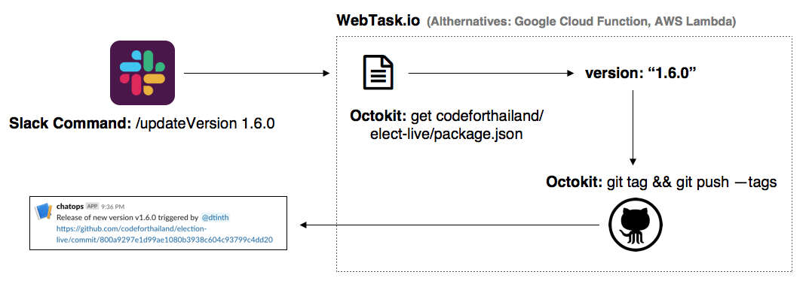

---
authors:
  - heytitle
  - dtinth
meta:
  - name: description
    content: เนื่องจากตัวระบบ ELECT Live มีผู้ร่วมพัฒนาหลายคน และทำงานแข่งกับเวลา เราจึงได้นำแนวคิด ChatOps มาใช้ โดยการสร้างบอท Slack เพื่อเพิ่มความสะดวกเวลาจะ​ deploy เวอร์ชั่นใหม่
  - property: og:image
    content: /share-images/elect-live-chatops-v1.png
---

# ถ้าปล่อยให้ทุกคนปล่อยเวอร์ชั่นใหม่กันเอง สับสนแน่นอน สร้างบอท ChatOps มาทำหน้าที่ Release manager แทนคนดีกว่า

<author-list></author-list>

เนื่องจากตัวระบบ ELECT Live มีผู้ร่วมพัฒนาหลายคน และทำงานแข่งกับเวลา
เราจึงได้นำแนวคิด [ChatOps](https://github.com/exAspArk/awesome-chatops) มาใช้
โดยการสร้างบอท Slack
เพื่อเพิ่มความสะดวกเวลาจะ​ deploy เวอร์ชั่นใหม่
((ดูซอร์สโค้ดได้บน GitHub)[1])

ซึ่งการมี ChatOps นี้ทำให้เราสามารถสั่ง deploy ​ระบบ ELECT Live จาก master branch ได้โดยตรงผ่านทาง Slack
แทนที่การรันคำสั่ง `git tag` จาก local repository​

## ทำ ChatOps แล้วดีกว่า Release เองผ่าน Git อย่างไร

การสร้าง release ใน Git จริงๆ ก็สามารถทำได้ แต่อาจเกิดความวุ่นวายในกรณีที่:

- มีคนหรือทีมที่ดูแลเรื่องการ release
  แต่ตอนนั้นเขาไม่ว่างที่จะ release ให้
- นักพัฒนาสามารถ release ได้เอง
  แต่ไม่สะดวก
  เนื่องจากกำลังพัฒนา feature อื่นๆ อยู่ใน branch ของตัวเอง
  local repository ไม่สะอาด
  และไม่อยาก `git stash` หรือ `git commit` งานที่ทำอยู่ เพื่อมา release code
- นักพัฒนาสามารถ release ได้เอง
  แต่บางครั้งอาจมีการสร้าง release commit ชนกัน
  ทำให้คนนึงต้อง `git reset --hard`
  ทำให้เกิดความกังวลการ release โค้ด

การมีบอทช่วย release code แทนคน
จึงช่วยอำนวยความสะดวกในการ release
และด้วยความที่สั่งงานผ่านระบบ chat
จึงช่วยให้ไม่ขาดการสื่อสารกับทีมเมื่อมีการ release เวอร์ชั่นใหม่

[1]: https://github.com/codeforthailand/elect-live-release-manager
