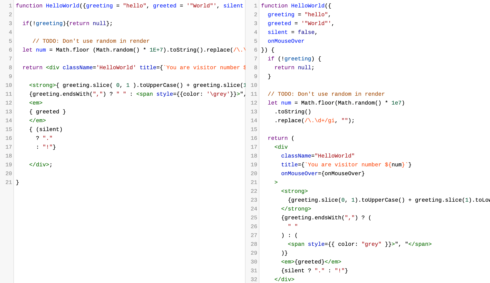

---
authors:
  - dtinth
---

# ทำให้ทุกคนเขียนโค้ดเป็นสไตล์เดียวกันโดยอัตโนมัติด้วย Prettier, Husky และ lint-staged

<author-list></author-list>

หลายครั้งที่ผมไปดูโค้ดของเว็บที่ทำกันเป็นทีม
สิ่งที่ผมเห็นเป็นประจำเลยคือ ต่างคนต่างมีสไตล์การเขียนโค้ดของตัวเอง

- บางคนใช้ Semicolon
  บางคนไม่ใช้
- บางคน Indent ด้วยการเว้นวรรค 2 ครั้ง
  บางคนก็ 4 ครั้ง
- บางคนก็เว้นวรรคหลังคำว่า `if`
  บางคนก็ไม่เว้น
- บางคนใช้ Double quote
  บางคนใช้ Single quote
- ฯลฯ

บางทีขนาดเขียนเองคนเดียวก็ยังไม่ค่อย Consistent กันเลย

เดี๋ยวนี้สิ่งที่ผมมักจะทำเป็นอย่างแรกๆ เวลาเริ่ม Set Up Project ที่ต้องทำงานกันหลายคน [รวมถึงเว็บ ELECT Live! นี้ด้วย](https://github.com/codeforthailand/election-live/commit/834ac7739a65f6854d96ddfc5b6f57a32395b068#diff-b9cfc7f2cdf78a7f4b91a753d10865a2) คือ
เซ็ตอัพให้คนทุกคนเขียนโค้ดออกมาแล้วมีการจัดรูปแบบโค้ดที่เหมือนๆ กัน โดยอัตโนมัติ
(นักพัฒนาแทบไม่ต้องทำอะไรเพิ่มเองเลย)

## เลิกเถียงกันเรื่องการจัดรูปแบบโค้ด โดยการใช้ Prettier

[Prettier](https://prettier.io/) เป็นโปรแกรมที่จัดรูปแบบโค้ด
โดยตัวโปรแกรมนี้ จะแทบไม่สนใจเลยว่าเดิมเราเขียนโค้ดรูปแบบไหน
มันจะจัดให้ในรูปแบบของมัน
จะได้เลิกเถียงกันสักทีว่าจะจัดโค้ดกันยังไง

:arrow_up: ตัวอย่างการจัดโค้ดด้วย Prettier — ด้านซ้าย: ก่อนจัด, ด้านขวา: หลังจัด

โดยที่ตัว Gatsby เอง ก็มี [Prettier config มาตรฐาน](https://github.com/gatsbyjs/gatsby-starter-hello-world/blob/4ee9f6a76cda86e434109776f0f31b9d3333fb39/.prettierrc)มาให้ตั้งแต่เริ่มเซ็ตอัพโปรเจค

## Husky + lint-staged

การมีเครื่องมืออัตโนมัติช่วยเป็นเรื่องที่ดี …ก็ต่อเมื่อทุกคนใช้มันเหมือนกัน… แล้วเราจะทำยังไงให้ทุกคนใช้เครื่องมือนี้เหมือนกันล่ะ? :thinking:

เพราะว่าต่างคนก็ต่างใช้ Text editor คนละตัวกัน
บางคนใช้ VS Code
บางคนใช้ Vim
จะบังคับให้ทุกคนมาใช้เครื่องมือเดียวกันหมดก็อาจจะไม่ใช่เรื่องที่ดีนัด

แต่ยังมีเครื่องมือตัวหนึ่งที่ทุกคนใช้เหมือนกันหมด นั่นก็คือ…

Git นั่นเอง!

เพราะถ้าไม่ใช้ Git ก็โหลดโค้ด ส่งโค้ดขึ้นมาไม่ได้

[แพ็กเกจ lint-staged บน npm](https://www.npmjs.com/package/lint-staged) เป็นเครื่องมือที่สามารถช่วยทำการเช็ค และจัดรูปแบบโค้ดแบบอัตโนมัติเวลาที่เราสั่ง `git commit`

อย่างเช่นของโปรเจค ELECT Live!
เมื่อนักพัฒนาสั่ง `git commit` จะมีการรัน Prettier โดยอัตโนมัติทันที:

<video src="./husky.webm" muted autoplay loop></video>

โดยวิธีการ Set up `lint-staged` ในโปรเจคก็ง่ายมาก
คือเมื่อหลังจากติดตั้ง Prettier เรียบร้อยแล้ว ก็สั่งคำสั่ง

    npx mrm lint-staged

มันจะทำการติดตั้งและตั้งค่า [Husky](https://www.npmjs.com/package/husky)
ซึ่งเมื่อแพกเกจนี้ถูกติดตั้ง
ตัว Husky จะแอบไปแก้ Config ของ Git
เพื่อให้มีการรัน Prettier เวลาสั่ง `git commit` ได้ ([เรียกว่า pre-commit hooks](https://githooks.com/))

หากต้องการจะติดตั้ง Husky และ lint-staged ด้วยตัวเอง
สามารถดูวิธีได้ใน[คู่มือของ Prettier](https://prettier.io/docs/en/precommit.html) เลยครับ
