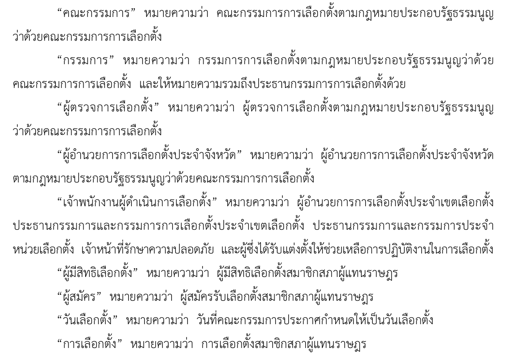
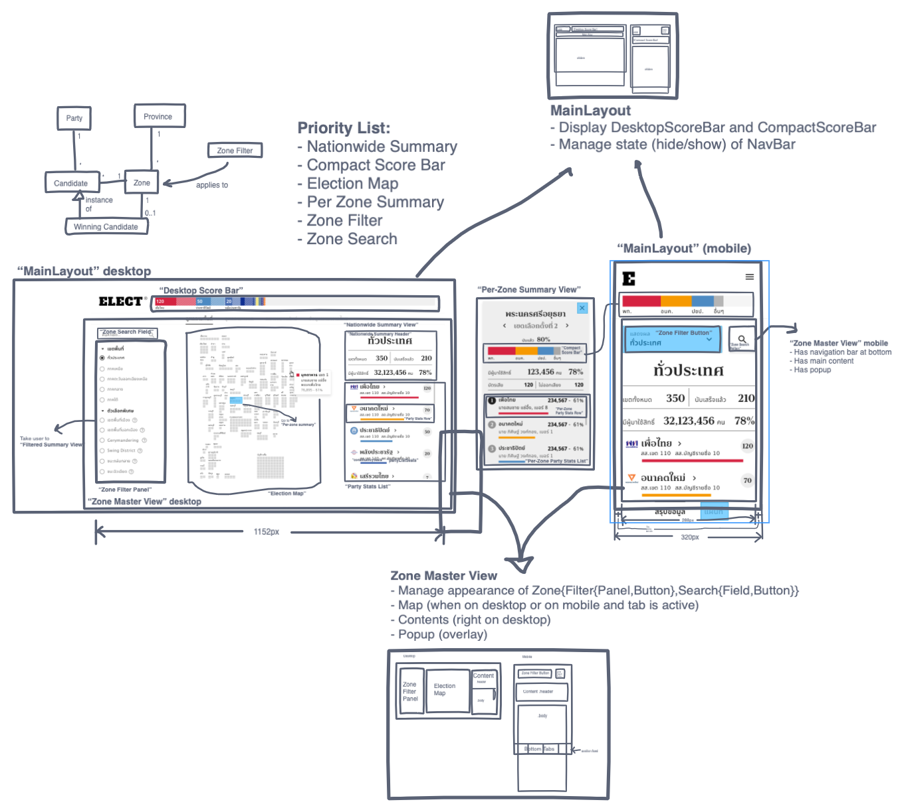

# ได้ดีไซน์มาอย่าเพิ่งรีบโค้ดทันที มาตั้งชื่อกันก่อน

ปกติเวลาผมทำโปรเจค หลายๆ ครั้งที่ผมมักจะเริ่มเขียนโค้ดเลย แล้วก็เกิดความงงในภายหลังเมื่อเราไม่ได้ตั้งชื่อของต่างๆ ในโปรแกรมให้เป็นไปในทางเดียวกัน อย่างเช่น เวลาที่ผมทำเกม บางทีก็ใช้คำว่า User บางทีก็ใช้คำว่า Player พอพัฒนาไปได้สักพักก็เริ่มงง

ในวงการอื่นๆ (โดยเฉพาะกฏหมาย) เพื่อให้ไม่งง ก็จะมีการกำหนดคำที่จะใช้ พร้อมความหมายของแต่ละคำไว้ก่อน เพื่อให้ใช้ไปในทางเดียวกัน

สำหรับโปรเจค ELECT Live! ก่อนที่จะเริ่มโค้ด ผมจึงนำดีไซน์มา แล้วตั้งชื่อให้องค์ประกอบต่างๆ ในนั้น ซึ่งวิธีที่ง่ายที่สุดก็น่าจะเป็นการใช้ Freehand นี่แหละ

ข้อดีของการทำแบบนี้ คือ เราสามารถดูชื่อขององค์ประกอบต่างๆ ได้ในหน้าเดียวเลย ดีกว่าเวลาเป็นโค้ด ที่ดูได้แค่ทีละไฟล์ ทำให้เราสังเกตการตั้งชื่อที่ไม่เป็นไปในทางเดียวกันได้ง่ายขึ้น และสามารถแก้ชื่อตรงนั้นได้ทันทีเลยก่อนที่จะเริ่มโค้ด
