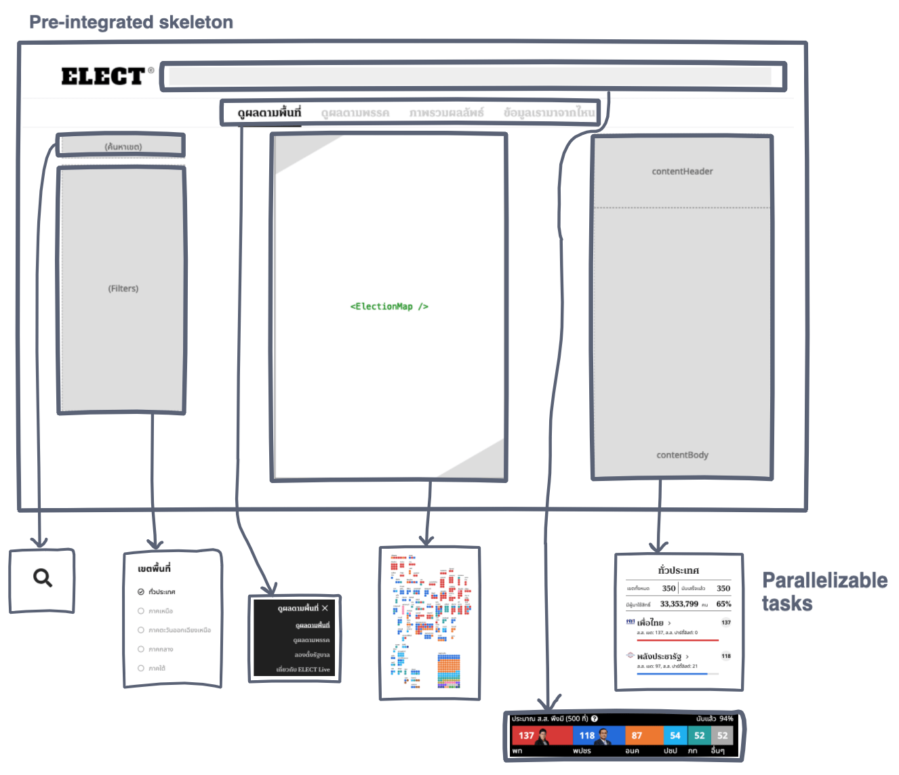
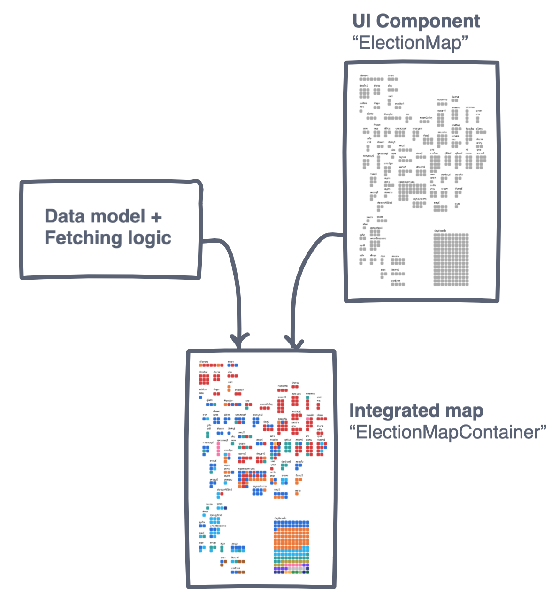
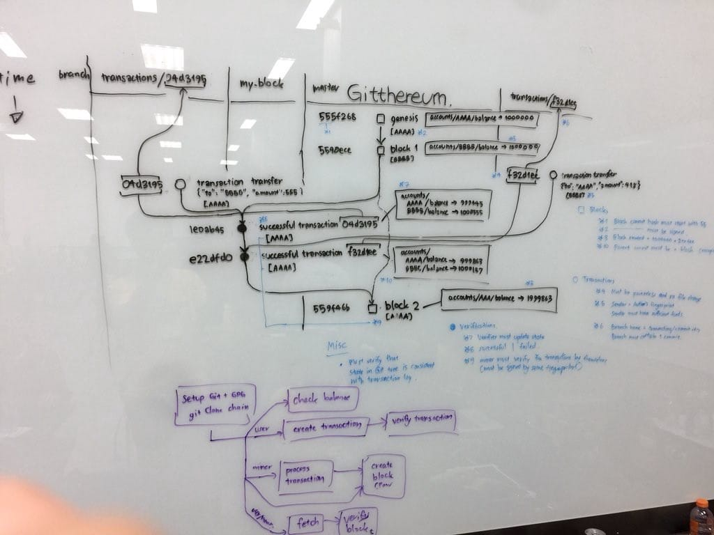

---
authors:
  - dtinth
---

# แบ่งคอมโพเนนต์ย่อยๆ ยังไงให้ทำงานไปพร้อมๆ กันได้โดยไม่เสียภาพรวมงาน

ตอนที่ทำเว็บ ELECT Live!
เรื่องหนึ่งที่ผมให้ความสำคัญเป็นอันดับแรกๆ คือ
จะวางโครงและแบ่งงานยังไงเพื่อให้คนในทีม รวมถึง Contributor ภายนอก สามารถพัฒนาเว็บนี้ไปได้พร้อมๆ กัน

อยากให้นึกย้อนไปถึงสมัยเรียนที่เราต้องทำรายงานกลุ่มกัน
ย้อนไปถึงดราม่าที่มักจะเกิดขึ้น เรื่องราวประมาณนี้:

1. ต้องทำรายงาน 5 บท เลยแบ่งให้ไปทำกันคนละบท
2. แต่ละคนก็หายไปทำรายงานตามบทของตัวเอง แล้วก็เอาเนื้อหากลับมาส่งในวันสุดท้ายก่อนส่งรายงาน
3. คนที่ทำหน้าที่รวมรายงานเป็นรูปเล่มก็น้ำตาตก เพราะแต่ละบทที่เขียนออกมาไม่โอเคเลยสักบท เขียนกันไปคนละทิศคนละทาง เนื้อหาแต่ละบทไม่สามารถเชื่อมกันได้เลย แล้วสุดท้ายก็แทบจะต้องทำรายงานนั้นใหม่คนเดียว อดหลับอดนอน

ในการพัฒนาซอฟต์แวร์
เวลาที่ผมทำงานเป็นทีม แล้วต้องแบ่งงานเป็น Component
ผมพบว่าผมใช้ 2 วิธีหลักๆ คือ:

1. **Pre-integrated approach** — เริ่มจากโครงสร้างที่เชื่อมกันตั้งแต่แรก แล้วพัฒนาแต่ละส่วนต่อจากตรงนั้นไปพร้อมๆ กัน
2. **Separated approach** — ต่างคนต่างทำแต่ละส่วน แล้วค่อยเอามาเชื่อมกันภายหลัง

แต่ละวิธีก็มีข้อดีข้อเสียต่างกันไป ก็ต้องเลือกใช้ให้เหมาะสมกับสถานการณ์

## Pre-integrated approach

เริ่มจากการสร้างโครงที่มีการเชื่อมต่อกันตั้งแต่แรก
เมื่อสร้างเสร็จ ส่วนประกอบต่างๆ ในโครงนั้นก็สามารถพัฒนาไปพร้อมๆ กันได้

หลายๆ ส่วนของเว็บ ELECT Live! ใช้วิธีนี้
เช่น โครงหน้าเว็บ

ข้อดี:

- เนื่องจากทุกอย่างถูกเชื่อมกันมาตั้งแต่ต้น
  จึงไม่ต้องกังวลว่าจะมีปัญหาในการเอาส่วนต่างๆ มาประกอบกันในภายหลัง
- เนื่องจากออกแบบและสร้างโครง มีการคำนึงถึงกรณีที่เป็นไปได้ต่างๆ ไว้ตั้งแต่ต้น
  โค้ดที่ออกมาโดยรวมแล้วจะดูสวยกว่า (มีการ Hack น้อยกว่า) และดูไปในทางเดียวกันมากกว่า
- แต่ละส่วนสามารถแตกเป็นงานย่อยๆ ต่อไปได้
  โดยเฉพาะเมื่อใช้ [Puzzle-Driven Development](../pdd/)
  ทำให้หลายๆ คนสามารถมาช่วยกันพัฒนาไปพร้อมๆ กันได้มากขึ้นอีก

ข้อเสีย:

- ต้องมีคนขึ้นโครงให้ก่อนถึงจะเริ่มพัฒนาไปพร้อมๆ กันได้
- ต้องสื่อสารกันเยอะเพื่อให้สามารถแบ่งงานกันได้

ใช้ในกรณีที่:

- งานใหญ่เกินที่เราจะทำคนเดียวได้
  หรือมีงานอื่นที่สำคัญกว่า เราจึงไม่สามารถทำงานนี้คนเดียวทั้งหมดได้
- ต้องการแบ่งงานให้หลายๆ คนสามารถเข้ามาช่วยกันทำได้
- งานมี Requirement ยังไม่แน่นอน

## Separated approach

ต่างคนต่างทำแต่ละส่วน โดยไม่จำเป็นต้องคำนึงว่าแต่ละส่วนจะทำงานยังไง
เมื่อทำทั้งสองฝั่งเสร็จแล้วค่อยเอามาประกอบกันในภายหลัง

ให้นึกถึงตัวอย่างการทำรายงานที่เสนอไปตอนต้นบทความ
แต่ในกรณีนี้ แต่ละคนรู้งานว่าจะทำอะไร และรู้ด้วยว่าทำยังไงงานถึงจะเอามาประกอบกันได้
สุดท้ายเลยนำมารวมกันได้อย่างไม่มีปัญหา ไม่ดราม่า แถมประหยัดเวลากว่าแบบ Pre-integrated approach อีก

ตัวอย่างหนึ่งที่เห็นได้ในเว็บ ELECT Live! คือแผนที่เขตการเลือกตั้ง
โดยพี่รพี (Front-end) สร้างคอมโพเนนต์ `ElectionMap` ด้วย D3 (ซึ่งผมใช้ไม่เป็นเลย)
ในขณะที่ผมก็เขียน Data Model ซึ่งเป็น Logic ในการ Fetch และ Synchronize ข้อมูล
โดยต่างฝ่ายต่างไม่รู้ว่าโค้ดของอีกคนจะหน้าตาออกมาเป็นยังไง

เมื่อสองส่วนนี้เสร็จ
สุดท้ายก็สร้าง ElectionMapContainer มา เพื่อเชื่อม 2 ส่วนนี้เข้าด้วยกัน

ข้อดี:

- งานบางส่วนทำคนเดียวเร็วกว่า โดยเฉพาะเรื่องที่เชี่ยวชาญมากๆ
  เพราะระหว่างทำมี Communication overhead น้อยกว่า

ข้อเสีย:

- การเขียนโค้ดอาจจะออกมาเป็นคนละสไตล์
  แต่ส่วนมาก เรื่องนี้ไม่ใช่ปัญหาใหญ่
  เพราะเราพร้อมจะเรียนรู้วิธีของอีกฝ่ายเช่นกัน
- มีความเสี่ยงว่าของที่ทำอาจจะเอามาประกอบกันไม่ได้ โดยเฉพาะหาก Shared vision ยังไม่ชัดเจน

ใช้ในกรณีที่:

- เรามี Vision ร่วมกันที่ชัดเจนพอที่จะรู้ว่าจะต้องทำอะไร
- เรารู้ Scope ของส่วนที่เราจะทำค่อนข้างชัดเจน ซึ่งไม่ใหญ่เกินไป สามารถทำคนเดียวได้
- เรารู้ว่าจะออกแบบและเขียนโค้ดยังไง เพื่อให้คนอื่นสามารถนำส่วนที่เราเขียนไปประกอบได้โดยง่าย

---

อีกตัวอย่างของท่านี้ คือสมัยที่ผม[ไปร่วมงาน Pizza Hackathon](https://www.facebook.com/dtinth/posts/10210634880222368) (Blockchain Hackathon ครั้งแรกของเมืองไทย) และ[รวมทีมกันลองสร้างระบบ Blockchain บน Git](https://medium.com/@peawyoyoyin/gitthereum-transforming-git-into-a-working-blockchain-538df6617ac6?fbclid=IwAR003MAfLlWzt8oF8HbAXlLTADGXTWJ7mhgvxGRpLJYH96Qozgwxc_6SOSk)

ก่อนที่จะเริ่มลงมือเขียนโค้ดกัน
เราลองทำ Proof-of-concept พร้อม Visualize กระบวนการทั้งหมดโดยละเอียด
จากภาพจะเห็นได้ว่าเขียนไว้ละเอียดมาก
มีการเอาตัวอย่างเลข Hash จริงๆ มาใช้
มีการ Visualize state ของ Git แบบ Low-level ไปจนถึงระดับ Tree และ Blob (ใช้เวลาประมาณ 5 ชั่วโมง โดยแทบไม่ได้เขียนโค้ดเลย)
ทั้งหมดนี่เพื่อให้ทุกคนเห็นภาพตรงกันหมด จนสามารถแบ่งงานกันไปทำกันได้เลย

แต่ถ้าเข้าไปดูโค้ด แทบจะรู้เลยว่าส่วนไหนใครเขียน
เพราะต่างคนต่างเขียนโค้ดคนละสไตล์เลย และเราไม่ได้ตกลงเรื่อง Coding style กันแม้แต่นิดเดียว
แต่สุดท้ายสิ่งที่สำคัญกว่าคือ ท่ามกลางความแตกต่าง โค้ดแต่ละส่วนเอามาประกอบกันได้ เพราะ Shared vision เราชัดเจน

## Mix and match

จะเห็นได้ว่าไม่มีวิธีไหนที่เหมาะสำหรับการใช้ในทุกๆ กรณี
แต่ละวิธีต่างก็มีข้อดีและข้อเสียต่างๆ กันไป
จึงไม่เกิดประโยชน์ที่จะถามว่าวิธีไหนดีสุด
แต่เราควรสามารถเลือกใช้วิธีที่เหมาะสมกับสถานการณ์มากกว่า
