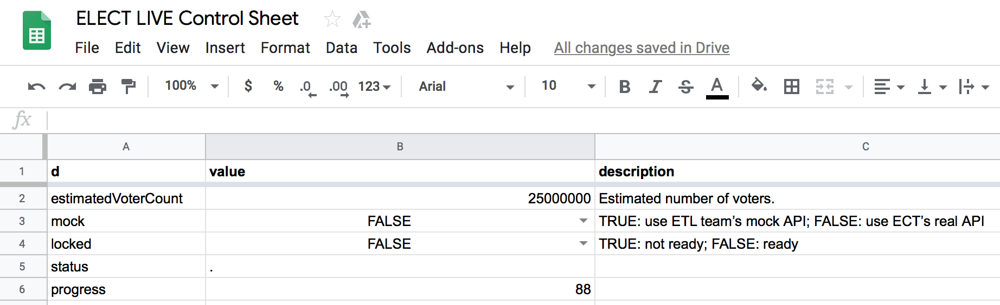

---
authors:
  - heytitle
---

# สร้าง Control Panel อย่างด่วนๆ ด้วย Google Sheets

เนื่องจาก​ ELECT Live! นั้นดึงข้อมูลจากระบบ dttpool
ที่ตัว APIs นั้นไม่มีความแน่นอนตั้งแต่ต้นว่า เราจะได้รับข้อมูลอะไรมาบ้าง
ตัวอย่างเช่น เราต้องการแสดงผลว่าแต่ละเขตเลือกตั้งนั้นนับคะแนนเสร็จหรือยัง เป็นต้น
ทาง dttpool ได้บอกว่าจะมีข้อมูลส่วนนี้ส่งมา
ให้เราแต่ยังไม่ถูกคอนเฟิร์ม 100% ขึ้นอยู่กับข้อมูลที่ทาง กกต. จะจัดส่งให้อีกที
เราจึงได้[สร้าง Control Panel][1] โดยใช้ Google Sheets

ข้อดีของการมี Control Panel แบบนี้นั้น
คือการที่เราสามารถเปลี่ยนแปลงค่า Config ของระบบโดยที่ไม่ต้องติดตั้งระบบใหม่เมื่อมีการแก้ไข
ตัวอย่างเช่น เราสามารถปรับเปลี่ยนการใช้งานระหว่าง Mock APIs กับ Real APIs ได้อย่างง่ายดาย

โดยสรุปแล้ว
การใช้ Google Sheets มาทำ Control Panel นั้นมีข้อดีและข้อเสียดังนี้

**ข้อดี**

- มีระบบ GUI / Collaboration ในตัว ไม่ต้องเขียนเพิ่ม
- สามารถ export sheet ออกมาเป็น CSV ได้เลย
- มี Version control

**ข้อเสีย**

- Google จำกัดจำนวนครั้งในการเข้าถึง ตัวอย่างเช่น 2M ครั้ง ต่อวัน
  - ในกรณีของเรา ข้อจำกัดนี้ไม่มีผลแต่อย่างใด เพราะเราใช้ Backend ETL ดึงค่า configs มาปล่อยให้ตัว Frontend อีกที
- เวลาเปลี่ยนค่า config อาจจะต้องรอซักพักก่อนที่การ download จะได้เวอร์ชั่นปัจจุบัน

[1]: https://docs.google.com/spreadsheets/d/1sbT-uhBsb1PkxTqsZGgOoWAsR9WTx68yVTF4CUzDgfA/edit#gid=0
