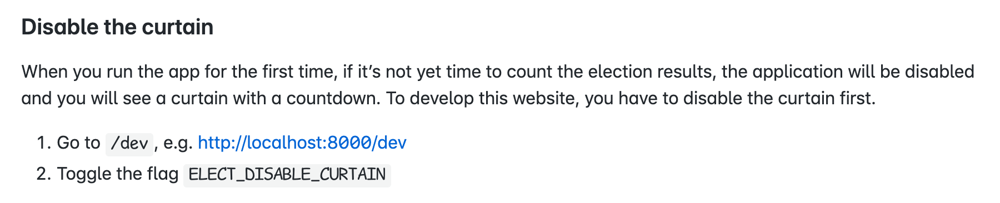
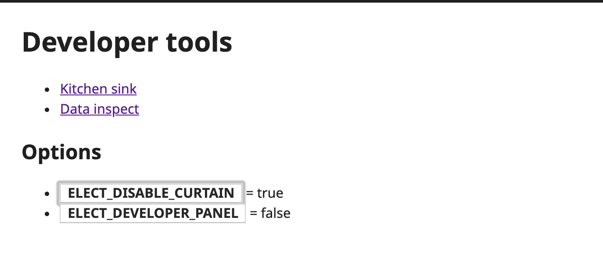
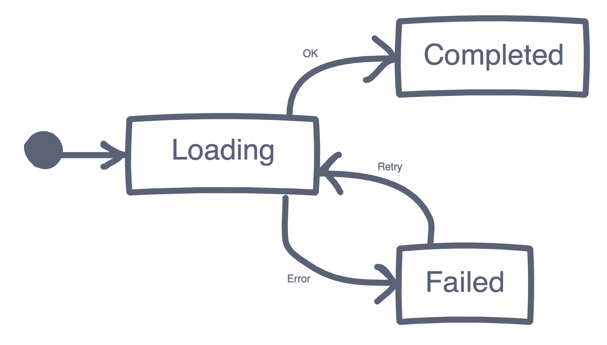
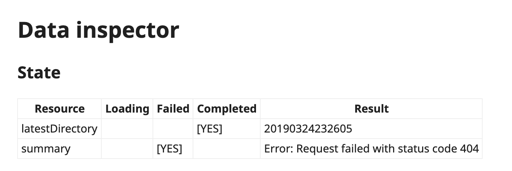
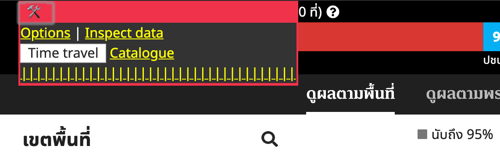
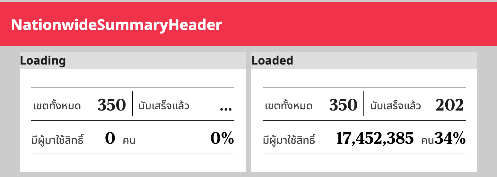

---
authors:
  - dtinth
---

# นึกถึง User experience (UX) แล้วอย่าลืมนึกถึง Developer experience (DX) ด้วย

<author-list></author-list>

User ได้เห็นหน้าเว็บสวยๆ ข้อมูลเข้าใจง่าย
แล้วทำไม Developer ถึงต้องมาอ่านข้อมูลภาษา JSON เองล่ะ?

การพัฒนาฟีเจอร์เพื่ออำนวยความสะดวกให้นักพัฒนา
บางครั้งก็ดูเหมือนเป็นงานที่กินเวลาเพิ่ม
แต่พอมีนักพัฒนาหลายๆ คน ก็ช่วยประหยัดเวลาได้

(ภาพหน้าจอโปรแกรมเบื้องหลังตู้เกม จาก [https://www.youtube.com/watch?v=bePORz2v9FE](https://www.youtube.com/watch?v=bePORz2v9FE))

สำหรับเว็บ ELECT Live! เราได้มีการสร้างหน้าเพิ่มเติมเพื่ออำนวยความสะดวกให้นักพัฒนาด้วย โดยได้ทำไว้ประมาณ 4 ส่วน

## Developing behind the curtain

ช่วงก่อนที่จะเริ่มนับผลการเลือกตั้ง
เพื่อป้องกันไม่ให้คนสับสนกับข้อมูล Mock
เมื่อคนเข้ามาที่เว็บ จะเจอกับหน้านี้
รวมถึงนักพัฒนาเองด้วย

หากนักพัฒนาหน้าใหม่ Clone โค้ดของเราไปลองในเครื่องแล้วพบกับหน้านี้ ก็คงจะงงไม่น้อยว่าเราจะแก้เว็บนี้ยังไง

ในไฟล์ README จึงมีการอธิบายว่า เมื่อเปิดเซิร์ฟเวอร์แล้ว ต้องเอาฉากกั้นออกก่อน ถึงจะสามารถพัฒนาหน้าเว็บส่วนอื่นๆ ได้

แล้วมีการสร้างหน้า Developer tools เพื่อให้นักพัฒนาสามารถกด เปิด/ปิด ฉากกั้นหน้าได้ โดยไม่ต้องไปแก้ค่าใน localStorage เอง

อีกท่าหนึ่งที่คิดขึ้นมาตอนนั้นคือ ถ้าเกิดกำลังพัฒนาใน localhost ให้ disable curtain โดยอัตโนมัติ
แต่ถ้าเกิดทำแบบนั้น นักพัฒนาที่ต้องการจะแก้โค้ดส่วน curtain ก็ต้องไปเปิดมันเอง
สุดท้ายจึงตัดสินใจทำให้เหมือนกันทั้งบน localhost และบนเว็บจริง แล้วทำปุ่มเปิดปิดสำหรับนักพัฒนา

## Data inspector

ขั้นตอนการโหลดข้อมูล
สำหรับฝั่ง User อาจจะดูไม่มีอะไรซับซ้อน — แค่รอให้ข้อมูลโหลดแล้วเราก็จะเห็นข้อมูล
และก็จะมีการ Refresh ข้อมูลใหม่เป็นระยะๆ

แต่เบื้องหลัง มีหลายกระบวนการเกิดขึ้น — คือระบบของเราจะโหลดข้อมูล Pointer ล่าสุด
เพื่อดูว่าไฟล์ข้อมูลล่าสุดเก็บไว้ที่ไหน
หลังจากนั้นจึงโหลดไฟล์ข้อมูลล่าสุดตามที่ Pointer นั้นชี้ไป

โดยที่กระบวนการพวกนี้ User ไม่ต้องรู้ก็ได้
ดังนั้นระหว่างโหลด เราจึงโชว์แค่ว่า “กำลังโหลด”
และหากโหลดไม่สำเร็จ เราก็โชว์แค่ว่า “กรุณาลองใหม่อีกครั้ง”

แต่สำหรับนักพัฒนา
เวลาข้อมูลโหลดช้า หรือหรือเวลาเกิดข้อผิดพลาด
เป็นเรื่องสำคัญมากที่นักพัฒนาจะสามารถรู้ได้ว่ามันผิดพลาดในขั้นตอนไหน จะได้แก้ได้อย่างตรงจุด

ในขณะที่โปรแกรมที่พัฒนาโดยไม่คำนึงถึง DX
ส่วนมากคือต้องเสียเวลาเปิด Chrome DevTools
แล้วไล่หาจุดผิดพลาดในหน้า Console หรือ Network
ซึ่งถ้าต้องทำหลายๆ ครั้งก็คงเสียเวลา
แล้วเวลาเรายิ่งมีน้อยอยู่

เราจึงทำหน้า Data inspector เพื่อดูสถานะการโหลดของข้อมูล
ทำให้รู้ทันทีเมื่อเกิดข้อผิดพลาด ว่าเกิดตรงจุดไหน เพราะอะไร

หากข้อมูลโหลดสำเร็จ ก็จะมีการนำข้อมูลมาแสดงผลเป็นตาราง
เพื่อที่เราสามารถเช็คได้ว่าข้อมูลนั้น ดูสมเหตุสมผลไหม

พอมีตัว Data inspector ช่วยให้เราเห็นข้อมูลได้ชัดเจนขึ้นเยอะมาก หลายๆ กันหลายครั้งช่วยให้เราสามารถตอบหลายๆ คำถามได้ทันที เช่น

- ทำไมหน้าเว็บถึงขึ้นข้อความค้างว่า กำลังรอข้อมูล
- ทำไมกล่องนี้ถึงไม่แสดงข้อมูลเป็นสีทึบ
- ทำไมจำนวน ส.ส. บัญชีรายชื่อถึงมีเท่านี้

## Developer panel

เนื่องจากหน้าเว็บของเรามีการแสดงผลข้อมูลที่เปลี่ยนไปตามเวลา
เราจึงสร้าง Developer panel (ซึ่งสามารถเปิดใช้งานได้ในหน้า Options)
เพื่อให้นักพัฒนาสามารถกดโหลดชุดข้อมูลทดสอบ เพื่อดูตัวอย่างว่าโปรแกรมจะแสดงผลข้อมูลอย่างไรสำหรับชุดข้อมูลนั้น

ภายหลังจากวันเลือกตั้ง
เรานำระบบนี้มาพัฒนาต่อนิดหน่อย กลายเป็น[ฟีเจอร์ Time Machine](https://web.facebook.com/electinth/videos/620545565077243/) ที่ทุกคนสามารถใช้ดูข้อมูลย้อนหลังได้

## Kitchen sink

และสุดท้ายมีการสร้างหน้า Kitchen sink คือ เอา Component ต่างๆ มากองๆ ไว้ในหน้านี้ เพื่อให้สามารถทดสอบ Component ในสถานะต่างๆ ได้ (คล้ายๆ ตัว [Storybook](https://storybook.js.org) แต่ทำในตัวเว็บไปเลย นักพัฒนาจะได้ไม่จำเป็นต้องเปิดเซิร์ฟเวอร์แยก)

แต่ด้วยความที่เว็บนี้ไม่ซับซ้อนมาก หลายๆ ส่วนสามารถพัฒนาตรงจุดที่ใช้ได้เลย หน้า Kitchen sink จึงไม่ได้ถูกนำมาใช้เยอะนัก

## Other DX

จริงๆ แล้ว DX ไม่ได้มีแค่เรื่องโค้ดอย่างเดียว
แต่รวมถึงด้านอื่นๆ ที่ทำให้นักพัฒนาทำงานได้ง่ายขึ้นด้วย
ซึ่งเราได้พูดถึงในหัวข้อก่อนหน้าแล้ว เช่น

- [ที่เราเลือกใช้ Gatsby](../gatsby/) ปัจจัยหลักคือ DX เลย
- [การใช้ Netlify](../netlify/) ที่ช่วยให้เราสามารถดูตัวอย่างโค้ดที่คนอื่นส่งเข้ามา โดยไม่ต้องโหลดมารันในเครื่องตัวเอง
- [การเขียน Documentation](../open-source/) ที่ช่วยให้นักพัฒนาหน้าใหม่เข้ามา แล้วหรือว่าจะต้องเริ่มจากตรงไหน

ดังนั้น เวลาพัฒนาโปรดักส์ นึกถึงความสะดวกของผู้ใช้แล้ว ก็อย่าลืมนึกถึงความสะดวกของตัวเองกันด้วยนะครับ :slightly_smiling_face:
