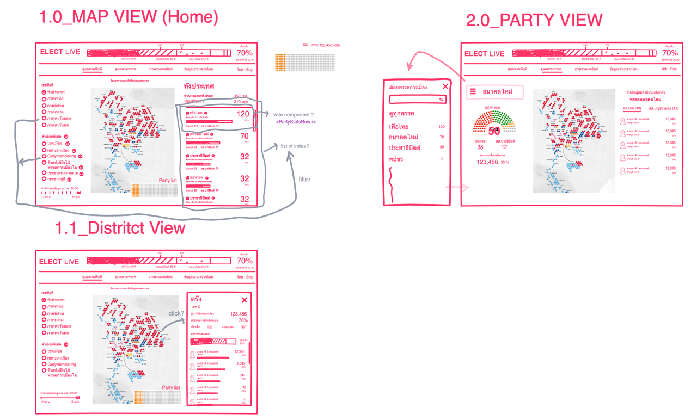
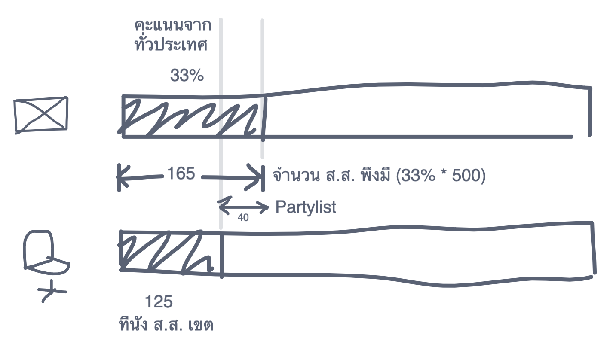
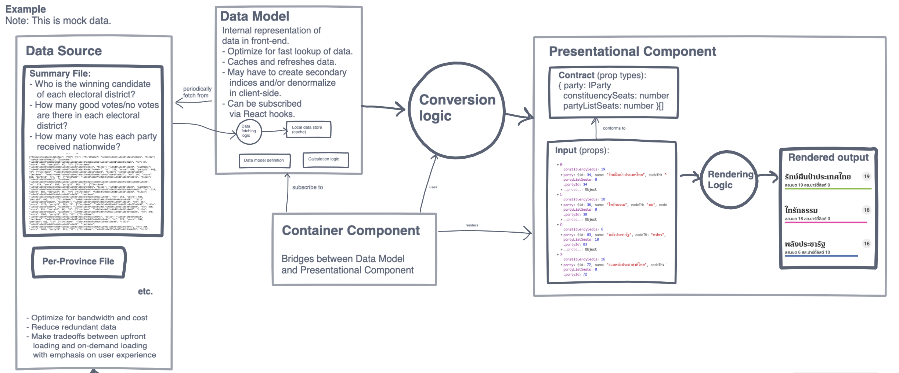
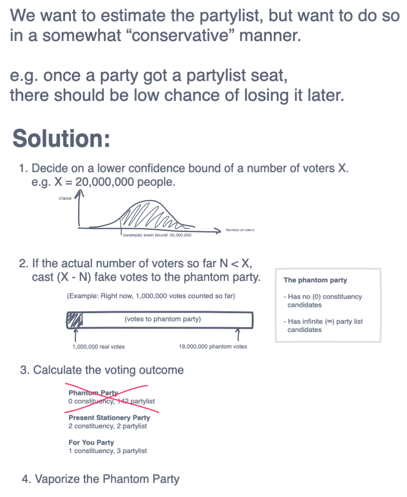
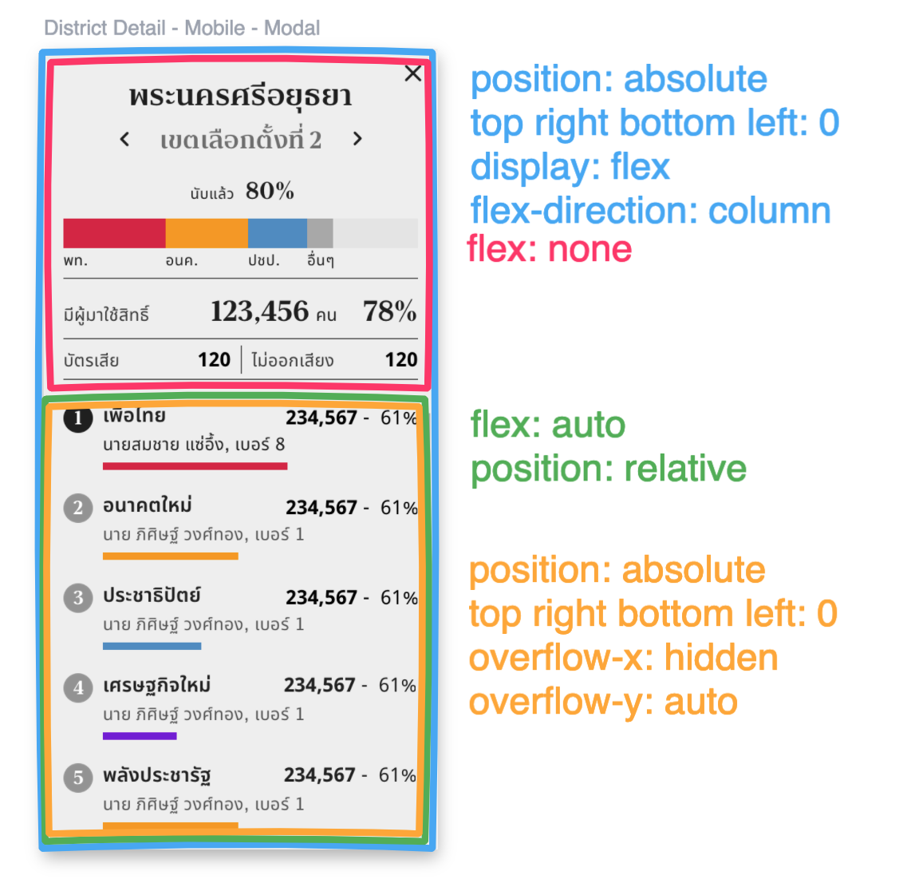

---
authors:
  - dtinth
---

# เห็นภาพเดียวกันถึงแม้ไม่ได้อยู่ที่เดียวกัน ด้วยการ Wireframe และ Visualize กันบน Freehand

<author-list></author-list>

ผมได้เข้ามาร่วมพัฒนาโปรเจกต์ ELECT Live! เพราะแฮม (Front-end) ชวนเข้ามาเป็นอาสาสมัคร

ตอนแรกก่อนที่ผมจะตอบตกลง ผมก็ไม่ค่อยรู้ว่า Project นี้มีอะไรที่ต้องทำบ้าง เลยลองถามดู
แฮมก็เลยส่งลิงก์ Wireframe ของเว็บที่จะทำมาให้ดู ซึ่งทำกันบน Freehand จาก InVision

พอได้ลองเล่นๆ ดูแล้ว ก็พบว่าเจ้า Freehand เนี่ยมันสุดยอดมากๆ

[Freehand](https://www.invisionapp.com/feature/freehand) เป็นเว็บที่ให้ผู้ใช้สามารถมาร่วมกันออกไอเดีย ผ่าน Wireframe, Diagram, หรือรูปต่างๆ ด้วยระบบ Whiteboard ออนไลน์
สามารถวาดและดูพร้อมกันได้หลายๆ คน โดยแต่ละคนจะถือปากกาคนละสี

ด้วยความที่ชอบ Visualize Idea อยู่แล้ว ก็เลยได้เอา Freehand มาใช้หลายรูปแบบมาก

ตั้งแต่การใช้ตั้งชื่อคอมโพเนนต์

การอธิบายวิธีคำนวณจำนวน ส.ส. แบบบัญชีรายชื่อ

การออกแบบ Architecture ของการส่งข้อมูล จากไฟล์ข้อมูลมาสู่การแสดงผลบนหน้าจอ

การออกแบบ Algorithm ในการแสดงจำนวน ส.ส. แบบบัญชีรายชื่อ ในขณะที่ยังนับคะแนนไม่เสร็จ ให้พอประมาณจำนวน ส.ส. แบบบัญชีรายชื่อได้คร่าวๆ

การคุยกันเรื่องการจัดวาง CSS Layout

บางอันก็ทำไว้ดูเอง บางอันก็เอาไว้ Collaborate กัน

ถือเป็น Tool อีกหนึ่งตัวที่รู้จักจากงานนี้ และได้ใช้ประโยชน์จากมันสุดๆ เลย
