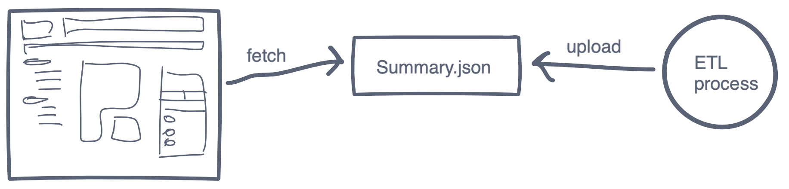
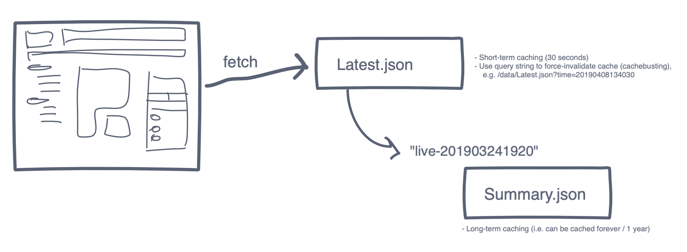

---
authors:
  - dtinth
---

# ย้อนเวลาได้ด้วยการไม่เขียนทับไฟล์เก่า

ตอนที่เราพัฒนาเว็บ ELECT Live!
ตอนแรกก็คุยกันว่าเราจะส่งข้อมูลจากระบบ ETL มาเข้าหน้า frontend ยังไงดี
ถึงจะสามารถโหลดได้รวดเร็ว และประหยัดค่าใช้จ่าย ในกรณีที่คนใช้พร้อมกันเยอะมาก

เราจึงตัดสินใจ[ใช้ท่า Static files ตามที่เขียนไว้ในหัวข้อก่อนหน้า](../static-caching/)

วิธีแรกที่คิดไว้คือ:

1. ให้ระบบ ETL เขียนทับไฟล์ต่างๆ
2. แล้วให้ Client-side ดึงข้อมูลไฟล์ใหม่ (Refresh) เรื่อยๆ เป็นระยะ

แต่ก็เกิดคำถามมากมายกับวิธีนี้ครับ:

- จะ Cache ไฟล์ไว้ยังไงดี
  นานขนาดไหน
- จะ Invalidate cache ยังไง
- หากไฟล์ข้อมูลมีขนาดใหญ่
  แล้วเกิดการโหลดไฟล์ขณะที่มันยังเขียนไม่เสร็จ
  แล้วไฟล์ที่ไม่สมบูรณ์ถูก Cache ไว้บน CDN ด้วย
  จะรับมือกับกรณีนั้นยังไง

เนื่องจากผมเคยทำงานกับระบบที่ใช้ Git
ซึ่งมีคอนเซปต์ของ immutable objects และ mutable refs
จึงเสนออีกท่าครับ
คือ:

1. ให้ระบบ ETL เขียนไฟล์ข้อมูลใส่ในโฟลเดอร์ใหม่ทุกครั้ง
   ไม่เขียนทับไฟล์เก่า (เนื่องจากไฟล์พวกนี้ไม่มีวันเปลี่ยน จึงสามารถกำหนดระยะเวลาการ Cache ได้นานๆ ไปเลย)
   หลังจากนั้นจึงเขียนชื่อโฟลเดอร์ใส่ลงไปในไฟล์ `latest.json`
   โดยไฟล์นี้จะกำหนดระยะเวลาการ Cache สั้นๆ
2. ให้ Client-side อ่านไฟล์ `latest.json` นี้เป็นระยะๆ ทุกๆ 30 วินาที
   โดยมีการใส่ `?time=____` เข้าไป เพื่อป้องกันปัญหาข้อมูลติดอยู่ใน cache
   หากชื่อโฟลเดอร์ที่ไฟล์นี้ชี้ไปเปลี่ยน ก็ให้โหลดข้อมูลใหม่จากโฟลเดอร์นั้น

ที่ใช้วิธีนี้หลักๆ ก็เพื่อป้องกันปัญหาการ Cache
แต่พอถึงช่วงพัฒนา เราพบข้อดีของมันเพิ่ม คือ **เราสามารถย้อนเวลากลับไปดูข้อมูลย้อนหลังได้**
เพราะเราไม่ได้เขียนทับไฟล์เก่า ไฟล์เก่าจึงยังอยู่ที่เดิม เป็นประโยชน์มากๆ:

- หากข้อมูลจำลองบางชุดมีการแสดงผลแปลกๆ
  เราสามารถย้อนกลับมา Debug ได้ ว่าเกิดจากอะไร
- เราจึงสามารถสร้างระบบที่ไว้โหลดข้อมูลเก่ามาแสดงผล
  [นักพัฒนาจึงสามารถทดสอบพวกอนิเมชั่นต่างๆ ได้](../dx/)โดยไม่ต้องรอให้ข้อมูลอัพเดท
- สุดท้าย เราเอาความสามารถนี้มาพัฒนาเป็น[ฟีเจอร์ Time Machine](https://web.facebook.com/electinth/videos/620545565077243/)
  ให้คนทั่วไปสามารถดูข้อมูลการนับคะแนนย้อนหลังได้

แต่ทำแบบนี้ก็ไม่ได้มีแต่ข้อดีอย่างเดียว
มีเทรดออฟด้วย:

- การแสดงผลข้อมูล
  ต้องโหลดไฟล์ 2 ไฟล์
  (รวม 2 round trip เพื่อโหลดข้อมูล)
  ทำให้การโหลดข้อมูลช้าลงนิดหน่อย
- ต้องใช้พื้นที่ในการเก็บข้อมูลเยอะขึ้น
  จึงต้องตั้งระบบให้แบ๊กอัพ บีบอัด และลบไฟเก่าเป็นระยะๆ
  (คืนก่อนเลือกตั้ง Server ที่เก็บไฟล์ HDD เต็มเลย ทำให้เราเจอปัญหาและเตรียมรับมือทัน)

เรื่องนี้ก็เป็นตัวอย่างนึง
ของความสวยงามของการจัดเก็บข้อมูลแบบ Immutable ครับ
