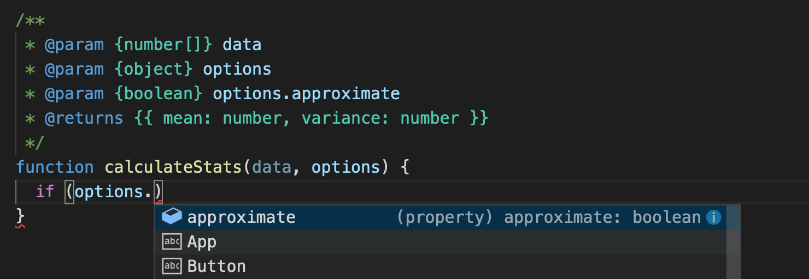
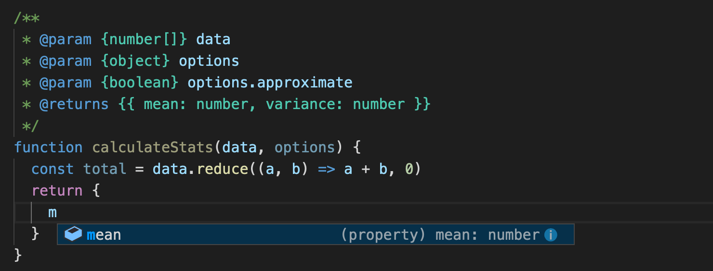
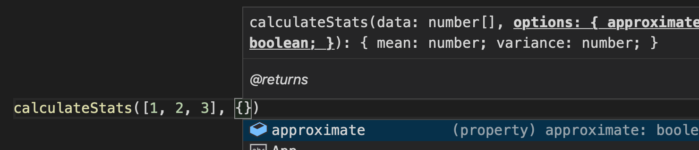
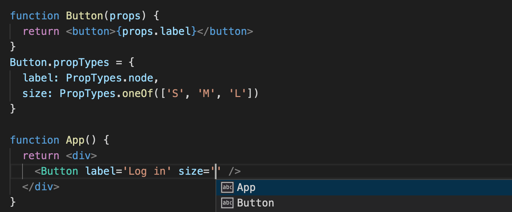
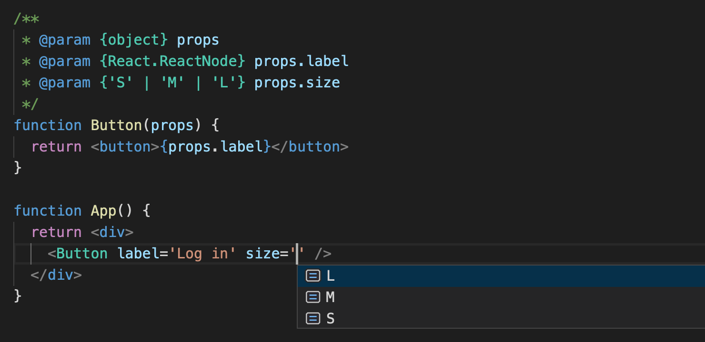
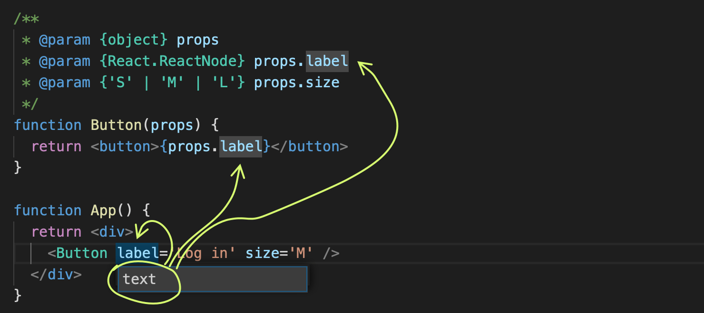

---
authors:
  - dtinth
---

# สละเวลาเขียน JSDoc สักนิด ไม่ใช่แค่ทำให้คนอื่นอ่านโค้ดเราเข้าใจง่ายขึ้น แต่ช่วยให้เขียนโค้ดได้เร็วขึ้นอีกด้วย

<author-list></author-list>

ปกติ JSDoc เราเอาไว้เขียน Documentation ว่าโค้ดของเราใช้ยังไง

หลายครั้งที่เราเจอโค้ดแบบนี้

```js
function calculateStats(data, options) {
    /* โค้ดอีก 100 บรรทัด */
```

ซึ่งพอเห็นโค้ดแบบนี้
ก็จะเกิดคำถามขึ้นมาทันที ว่า…

- `data` มันหน้าตายังไง
  เป็น array หรือ object
- `options` ใส่ค่าอะไรเข้าไปได้บ้าง
- ของที่ return ออกมาหน้าตาเป็นยังไง

แต่ถ้าเราใส่ JSDoc เข้าไปสักนิด…

```js{1-6}
/**
 * @param {number[]} data
 * @param {object} options
 * @param {boolean} options.approximate
 * @returns {{ mean: number, variance: number }}
 */
function calculateStats(data, options) {
```

ช่วยให้สามารถตอบทั้ง 3 คำถามด้านบนได้เลย
เพียงแค่อ่านตรงหัวฟังก์ชัน

แต่นอกจากนี้
**Visual Studio Code ยังสามารถอ่านโค้ด JSDoc ของเรา
เพื่อช่วยให้เราเขียนโค้ดและแก้โค้ดได้สะดวกขึ้นอีกด้วย**
(อ่านรายละเอียดเพิ่มเติมได้ใน[คู่มือ VS Code เกี่ยวกับ JS Doc Support](https://code.visualstudio.com/docs/languages/javascript#_js-doc-support))

## ตัวอย่างการใช้ JSDoc เพื่อให้เขียนโค้ดสะดวกขึ้น

ตัวอย่างต่อไปนี้
ถ้าเกิดเอา JSDoc ออก
VS Code จะไม่สามารถช่วยเราได้...

เวลาเราเขียนฟังก์ชัน
ถ้ากำหนดชนิดของ parameter แล้ว
VS Code จะสามารถช่วย auto complete พวก method ต่างๆ ใน parameter ที่เรารับค่าเข้ามาได้



(พอ VS Code รู้ว่า options ของเราเก็บอะไรได้บ้าง
ก็ช่วย autocomplete ค่าต่างๆ ใน options ได้)


(พอ VS Code รู้ว่า data เป็น array ที่เก็บตัวเลข
ก็สามารถแนะนำ method พวกนี้ได้)



(เนื่องจากกำหนด return type ไว้
ตอนที่เขียนโค้ด VS Code จึงสามารถช่วย autocomplete สิ่งที่ต้อง return ออกมาจากฟังก์ชันได้)

นอกจากตอนเขียนฟังก์ชัน
ตอนเอาฟังก์ชันไปใช้ VS Code ก็สามารถแนะนำได้



## ตัวอย่างการใช้ JSDoc กับ React

ปกติเวลากำหนดหน้าตาของ props ให้ React Component ต่างๆ
เรามักจะใช้ `propTypes`
แต่ปัญหาคือ
การกำหนด type ด้วยวิธีนี้ เป็นท่าเฉพาะของ React
ทำให้พวก text editor ต่างๆ ไม่สามารถช่วยเราได้



(ตกลงใส่ size อะไรได้บ้างนี่... ถ้าคอมโพเนนต์อยู่อีกไฟล์คงต้องเปิดโค้ดตามเข้าไปดู)

ถ้าหากเราใช้ JSDoc แทน propTypes
จะเห็นว่า VS Code สามารถช่วย autocomplete ได้แม้กระทั่งค่าของ props ต่างๆ ที่เรากำหนดขึ้นเอง



นอกจากนี้
หากเราต้องการเปลี่ยนชื่อ prop ใดๆ
เราสามารถกดปุ่ม F2 เพื่อเปลี่ยนชื่อ prop นั้นได้เลย
โดย VS Code จะทำการแก้โค้ดทุกที่ ที่มีการเรียกใช้ component นี้ ให้โดยอัตโนมัติ



## DX

จะเห็นว่าการเขียน JSDoc เป็นอีกวิธีที่จะช่วยทำให้ [DX](../dx/) ของโปรเจกต์เราดีขึ้น
เพราะทำให้สามารถเข้าใจโค้ดและเขียนโค้ดได้เร็วขึ้น
และสามารถ refactor โค้ดได้ง่ายขึ้นครับ
