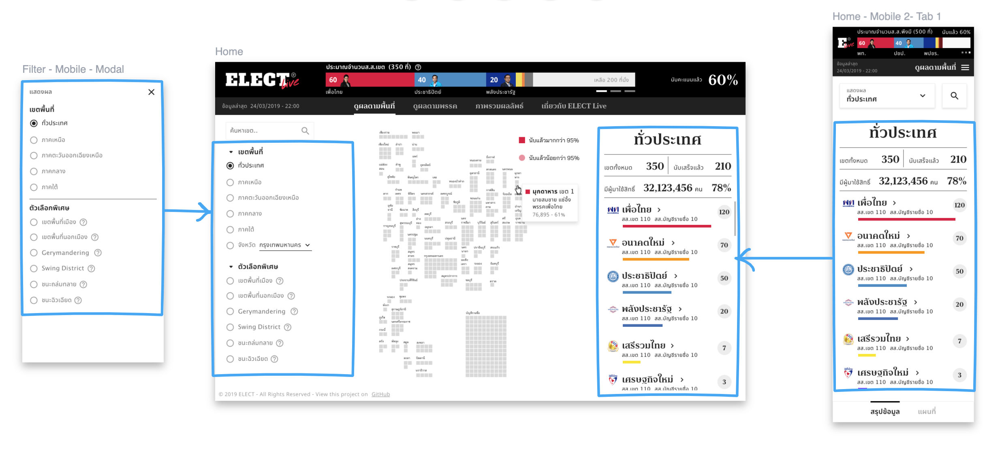

---
authors:
  - dtinth
---

# ออกแบบเว็บแบบ Mobile-first ไม่ต้องทำงานซ้ำสอง

ปกติหลายๆ ครั้งเวลาออกแบบหน้าเว็บ เรามักจะเริ่มจากการออกแบบหน้าเว็บสำหรับดูบนจอเดสก์ท็อปก่อน

แต่หลังจากที่มีการ[สำรวจผู้ใช้](../user-survey/)แล้ว พบว่า คนเกือบทุกคนที่ตอบ บอกว่าจะเปิดเว็บนี้ดูในมือถือ เลยคุยกันว่าโปรเจกต์นี้อยากจะทำเป็นแบบ Mobile-first

อย่างน้อยหากเวอร์ชั่นเดสก์ท็อปทำไม่เสร็จ บนมือถือต้องดูโอเค

ทีม Design ของ ELECT Live! ก็เลยจัดดีไซน์แบบนี้มาให้
ซึ่งเราก็พบว่ามันประหยัดเวลาในการพัฒนาได้เยอะมากๆ

ข้อดีหลักๆ ของการพัฒนาเว็บแบบ Mobile-first คือ
พวกองค์ประกอบ UI ต่างๆ ในหน้าจอมือถือ ส่วนมากสามารถเอามารียูสในหน้าจอเดสก์ท็อปได้ทันที เพียงแค่จัดหน้าให้สวยงาม
(ในขณะที่หลายๆ ครั้ง การเริ่มทำจาก UI สำหรับเดสก์ท็อปก่อน แล้วค่อยพัฒนาเวอร์ชั่นสำหรับมือถือ คือแทบต้องทำใหม่)

นอกจากนี้เราต้องใส่ใจเพื่อให้หน้าเว็บโหลดเร็วๆ บนมือถือ

ซึ่งถ้าเราทำให้บนมือถือโหลดเร็วได้แล้ว บนเดสก์ท็อปจะโหลดเร็วกว่าขนาดไหน?

หลายๆ ครั้งที่เว็บบนมือถือถูกตราหน้าว่าช้า
แต่นั่นไม่ได้เกิดจากการละเลยเรื่องความเร็วบนมือถือ ทำมันแต่บนเดสก์ท็อป จนกระทั่งพอถึงเวลาที่ต้องมาปรับเว็บให้ใช้ได้บนมือถือ มันก็สายเกินไปเสียแล้วหรอกหรือ?
