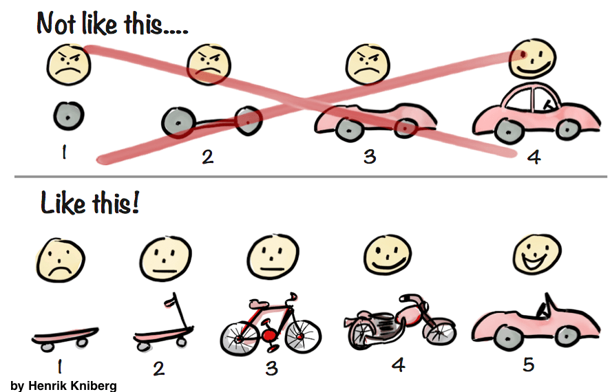

---
authors:
  - dtinth
---

# ทำ MVP ทีละหน้า แทนที่จะแบ่งหน้ากันทำแล้วอาจจะไม่เสร็จสักหน้า

<author-list></author-list>

<figure>
  
  <figcaption>
    รูปจาก<a href="https://blog.crisp.se/2016/01/25/henrikkniberg/making-sense-of-mvp">บทความ Making sense of MVP โดย Henrik Kniberg</a>
  </figcaption>
</figure>

หลายๆ คนน่าจะรู้จักคำว่า MVP กันดี
แต่เวลาทำเว็บเป็นทีม มักจะเจอที่มีการแบ่งงานโดยให้แยกหน้ากันทำ
ซึ่งมักจะเจอปัญหาตามมาก็คือ

- ต่างคนต่างเขียนโค้ด สไตล์ไม่ Consistent กัน
- บางทีทำเสร็จแล้วแต่เอามา Integrate เข้ากันไม่ได้
- หรือบางทีก็ทำไม่เสร็จสมบูรณ์สักหน้า

ก่อนที่เราจะเริ่มพัฒนาเว็บ ELECT Live!
เราจึงมีการมาประชุม และทำ Workshop คุยกันว่าหน้าไหนสำคัญสุด หน้าไหนสำคัญรองลงมา
เพื่อให้ถ้าสุดท้ายแล้วเราพัฒนาทั้งเว็บไม่เสร็จครบทุกหน้าที่ต้องการได้ทันเวลา อย่างน้อยหน้าที่ทำไปแล้วก็ควรจะดีพอให้ User ใช้

สุดท้ายแล้วเวลามันก็น้อยเกินไปจริงๆ
ตอนแรกเราตั้งใจว่าจะมีหน้าเพจที่โชว์ “ภาพรวมผลลัพธ์” แต่สุดท้าย ในวันเลือกตั้งก็ทำไม่ทัน และต้องตัดออกไปก่อน

## “แต่ถ้าเกิด Developer มารุมกันทำหน้าเดียวกัน ไม่เกิด Conflict แย่หรอ?”

หากแบ่งงานและจัดโครงสร้างไม่ดี เกิดปัญหาตามมาแน่นอน

สิ่งที่ช่วยให้ลดการเกิดปัญหาดังกล่าว คือ
การออกแบบโครงสร้างของตัวเว็บไซต์ ให้เป็นส่วนประกอบย่อยๆ (Components) เพื่อให้นักพัฒนาแต่ละคนสามารถพัฒนาส่วนต่างๆ ไปพร้อมๆ กันได้ ([เป็นหนึ่งในเหตุผลที่เลือกใช้ React สำหรับการพัฒนา](https://reactjs.org/docs/thinking-in-react.html))
แยกส่วนโค้ดให้ชัดเจนเพื่อลดโอกาสการเกิด Conflict เวลาหลายๆ คน แก้โปรเจกต์พร้อมๆ กัน
และใช้เทคนิคการแบ่งงานที่ดี

เราจะคุยกันเกี่ยวกับเรื่องพวกนี้ในหัวข้อถัดๆ ไปครับ
