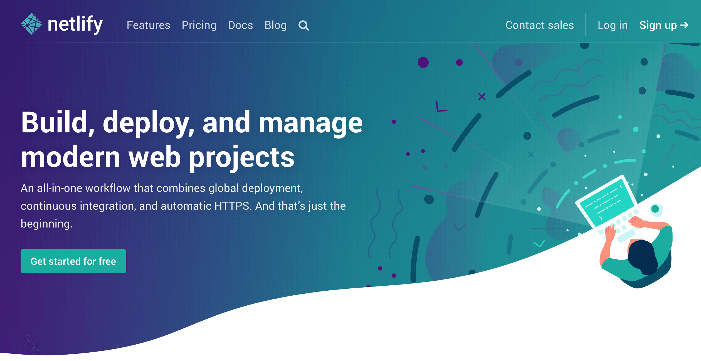
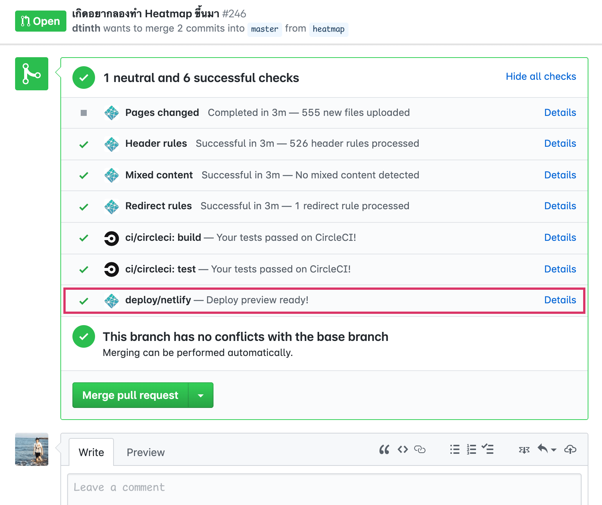

---
authors:
  - dtinth
---

# ทดสอบโค้ดของคนอื่นโดยไม่ต้อง Checkout มารันเองด้วย Netlify

น่าเบื่อไหม?
ทุกครั้งที่เราต้องการจะรีวิว Pull request ของคนอื่น เราต้อง checkout branch ของเขามารันในเครื่องตัวเองจึงจะสามารถรีวิวได้
ผมคนนึงล่ะครับที่เบื่อและขี้เกียจมากๆ

จนกระทั่งมาเจอ Netlify
ซึ่งเป็นบริการ Web hosting สำหรับเว็บสมัยใหม่
โดยวิธีการอัพโหลดเว็บ คือ
แค่ push โค้ดขึ้น GitHub/GitLab/BitBucket
แล้วตัว Netlify มันก็จะเอาโค้ดจาก Repository ไป build และ deploy ให้เลยโดยอัตโนมัติ

## Deploy preview

นอกจากเป็นแค่ Web hosting แล้ว
มันยังสามารถช่วยสร้าง Deploy preview เวลามีคนส่ง Pull request มาให้เรารีวิวด้วย
โดยเมื่อมีคนส่ง Pull Request เข้ามา
ตัว Netlify จะนำโค้ดที่ส่งเข้ามาไป build และ deploy ขึ้นไปบนโดเมนเฉพาะกิจให้เลย
ทำให้สามารถดูตัวอย่างได้ทันที

เพียงเท่านี้
เวลาผมดู PR ใน GitHub
ผมสามารถกดตรง “Deploy preview”
ก็จะสามารถลองทดสอบโค้ดที่คนอื่นส่งเข้ามาได้ทันที ไม่ต้องโหลดโค้ดมารันเองในเครื่องเลย
