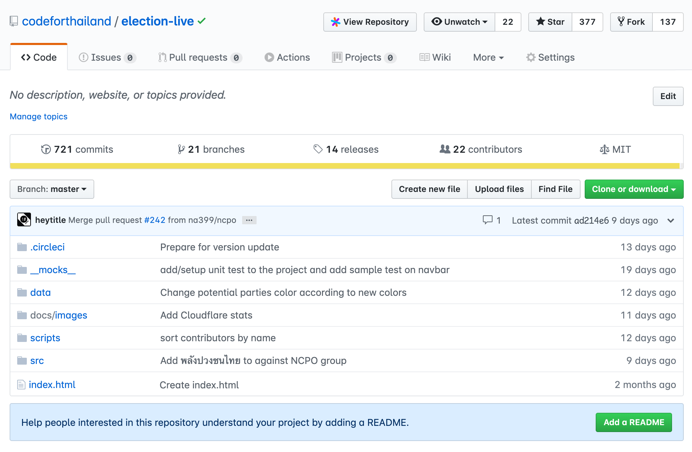
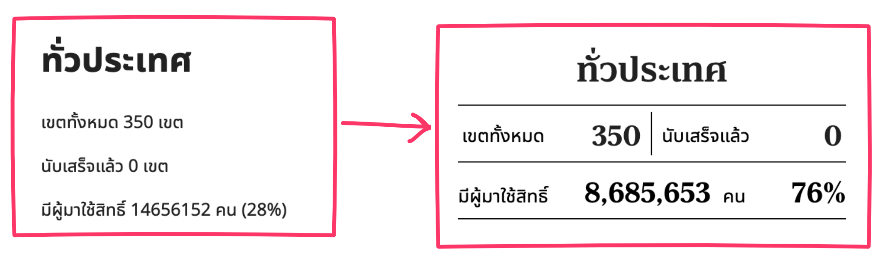
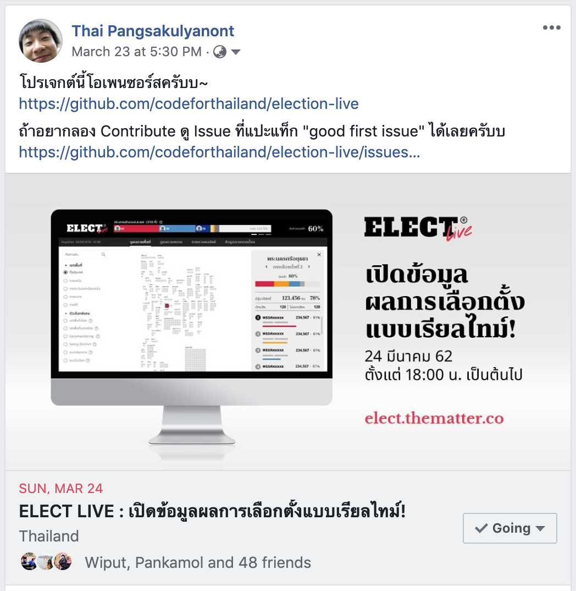
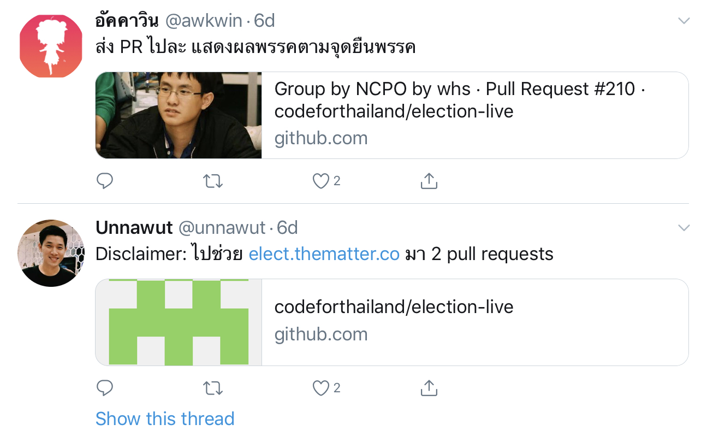
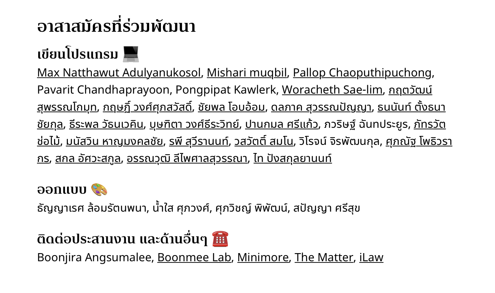
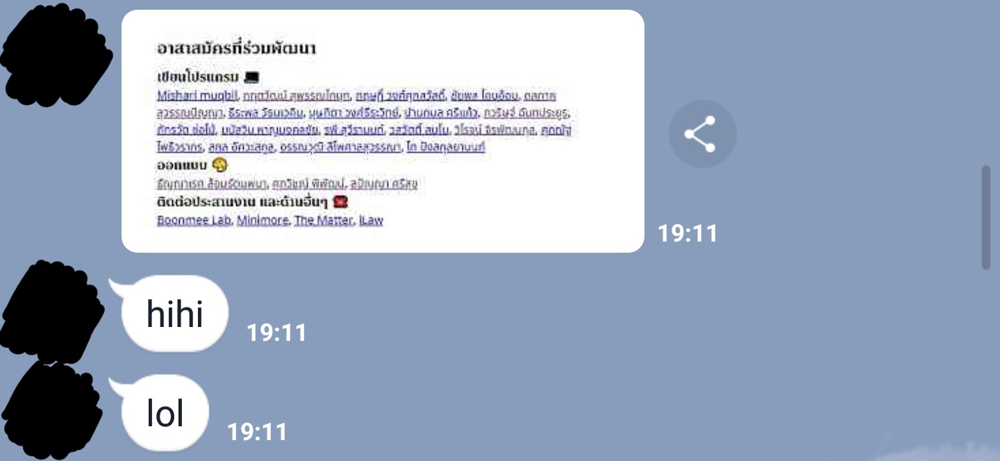
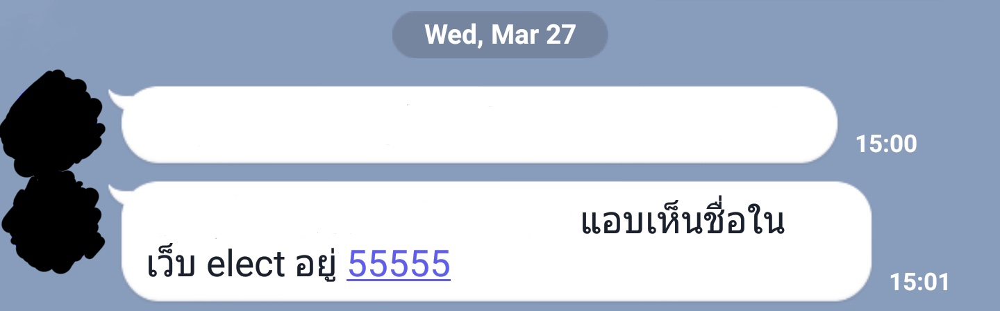

---
authors:
  - dtinth
  - unnawut
---

# เตรียมโปรเจกต์ให้คนจากภายนอกสามารถมาร่วม Contribute ได้

<author-list></author-list>

ตอนที่เราประชุมเรื่องการพัฒนาเว็บ ELECT Live!
ตอนแรกมีคนที่จะทำ Frontend อยู่แค่ประมาณ 5–6 คนเอง

แต่เนื่องด้วยเวลาที่มีเพียง 8 วันก่อนถึงวันเลือกตั้งและนับคะแนน
เราจึงเลือกทำให้โปรเจคนี้เป็น Open source และทำให้คนสามารถมาช่วยร่วมมือพัฒนาได้ง่าย สุดท้ายแล้วเรามี[ผู้ร่วมพัฒนาหน้า Frontend ของ ELECT Live!](https://github.com/codeforthailand/election-live/graphs/contributors) กว่า 20 คน

แต่การทำโปรเจค Open source ไม่ใช่ว่าแค่ปล่อยโค้ดไปบน GitHub แล้ว คนจะเข้ามาร่วมพัฒนาเลย… ถ้าเกิดเข้ามาที่หน้าโปรเจคบน GitHub ครั้งแรก แล้วเจอแต่รายชื่อไฟล์แบบนี้​…

…ก็งงไปสิครับ แล้วก็คงกดปิดออกมา

เราจึงทำการเตรียมโปรเจค ELECT Live! ให้คนภายนอกสามารถเข้ามาร่วมพัฒนาได้ โดยการทำหลายๆ อย่าง…

## ตั้งเป้าหมายเพื่อสร้างคุณค่าให้ทุกคนที่ผ่านเข้ามา

ไหนๆ จะทำโปรเจคให้เป็น Open source ทั้งที
ก็เลยกำหนดเป้าหมายสำหรับโปรเจคนี้ไว้ว่า…

1. อยากให้คนที่ร่วมพัฒนาโปรเจคนี้ ทั้งในทีมและจากภายนอก ได้เทคนิค เครื่องมือ วิธีการ และแนวคิด ต่างๆ กลับไป
   และสามารถไปใช้ในงานของตัวเอง
2. ถึงอาจจะไม่ได้ส่งโค้ดเข้ามา
   แต่อย่างน้อยก็ควรจะได้ประโยชน์จากการศึกษาโค้ด หรือแนวคิดต่างๆ ของโปรเจคนี้
3. อยากจะเปิดโอกาสให้นักพัฒนาภายนอก สามารถเข้ามาช่วยร่วมพัฒนาได้โดยง่าย

## เตรียมคู่มือสำหรับนักพัฒนาใหม่

ไม่ใช่นักพัฒนาทุกคนที่จะรู้เทคนิคต่างๆ ที่เราใช้กันในโปรเจคทั้งหมด จึงเป็นเรื่องที่สำคัญมากที่จะเขียนไว้ในไฟล์ README ให้ชัดเจน ว่าหากต้องการจะร่วมพัฒนาโปรเจคนี้ให้ทำยังไง

- [ต้องติดตั้งซอฟต์แวร์อะไรบ้าง](https://github.com/codeforthailand/election-live#prerequisites)
- [โคลนโค้ดมาแล้วต้องทำยังไงต่อ](https://github.com/codeforthailand/election-live#install-dependencies)
- [เราเขียนโค้ดกันยังไง ควรรู้เรื่องอะไรบ้าง](https://github.com/codeforthailand/election-live#resources-for-developers) เช่น [การจัดหน้า](https://github.com/codeforthailand/election-live#styling), [การทำ Responsive design](https://github.com/codeforthailand/election-live#responsive-design), ฯลฯ
- [เราแบ่งงานและจัดการงานต่างๆ ที่ต้องทำกันยังไง](https://github.com/codeforthailand/election-live#todo-comments-)

บางทีมีน้องทักแชทมาถาม ว่าหลังจากโคลนโปรเจคมาแล้วทำยังไงต่อ นั่นแปลว่า README ยังเขียนไม่เข้าใจง่ายพอ หลังจากที่ตอบผมก็ไป[อัพเดทไฟล์ README ให้ชัดเจนยิ่งขึ้น](https://github.com/codeforthailand/election-live/commit/caaac49ab7cd2f63ec557a45002c2a410318d0f2)

## แบ่งงานเป็นงานเล็กๆ หางานที่ทำง่ายๆ แล้วปล่อยให้คนที่สนใจมาช่วยทำดู

หากผมเป็นนักพัฒนาที่อยากจะลองมาช่วยพัฒนา Open source
แล้วกดหน้า Issue เข้าไป
แล้วเจอแต่ Issue ยากๆ ที่ต้องใช้เวลาทำนานๆ
ก็อาจจะรู้สึกหมดแรงตั้งแต่ยังไม่ได้เริ่ม

เนื่องจากเราใช้ [PDD](../pdd/ 'Puzzle Driven Development') เราจึงสามารถย่อยงานจนเหลืองานที่เล็กมากๆ ทำไม่ยาก แต่ต้องการคนทำ เช่น

- [ช่วยใส่แท็ก `<title>` ให้หน่อย ใช้ Helmet นะ](https://github.com/codeforthailand/election-live/issues/10)
- [ช่วยแก้ฟังก์ชั่น `getPartyById()` ให้เร็วขึ้นหน่อย เดิมมันทำงานเป็น O(n) ช่วยแก้ให้เหลือ O(1) หน่อย](https://github.com/codeforthailand/election-live/issues/6)
- [ช่วยแก้ฟังก์ชั่น `getProvinceById()` ให้เร็วขึ้นหน่อย เดิมมันทำงานเป็น O(n) ช่วยแก้ให้เหลือ O(1) หน่อย](https://github.com/codeforthailand/election-live/issues/5)
- [คอมโพเนนต์ `<PartyStatsRow />` ยัง Hardcode ข้อมูลอยู่เลย ช่วยทำให้มันรับ Props แล้วส่ง Props เข้ามาหน่อย ยังไม่ต้องเป็นข้อมูลจริงก็ได้ แค่ให้มันรับ Props ได้ก็พอ](https://github.com/codeforthailand/election-live/issues/13) (แล้วก็ทำ TODO สำหรับการส่งข้อมูลจริงเข้ามา)
- [ใส่ Progressive Web App Manifest ให้หน่อย ใช้ gatsby-plugin-manifest](https://github.com/codeforthailand/election-live/issues/11)
- [ช่วยปรับหน้าตาของ NationwideSummaryHeader ให้ตรงตาม Design หน่อย](https://github.com/codeforthailand/election-live/issues/41)

เวลาผมทำงานแล้วเจอกับงานละเอียดพวกนี้
แทนที่จะทำมันไปเลย (ซึ่งอาจจะใช้เวลาหลายนาที เพราะเป็นงานละเอียด)
ผมใส่ `// @todo` เข้าไปแทน
แล้วก็เขียนคำอธิบายใน Issue
หรืออัพโหลดภาพ Design เพิ่มเติม
หลังจากนั้นก็ใส่ label **“help wanted”**
และสำหรับ Issue ที่คิดว่าถึงเป็นคนภายนอกก็สามารถทำได้ไม่ยาก ก็จะใส่ label **“good first issue”** เข้าไป
ระหว่างนั้นผมก็สามารถไปทำงานส่วนอื่นที่สำคัญและเร่งด่วนกว่า

เมื่อผมมี Issue ที่เป็น “good first issue” จำนวนหนึ่งแล้ว
ก็เริ่มเชิญชวนเพื่อนครับ…

- เพื่อนบางคนที่อาจจะยังเขียนโค้ดไม่ค่อยแข็ง และอยากฝึกฝีมือการเขียนโค้ดกับโปรเจคที่ใช้งานจริงๆ
- เพื่อนบางคนที่อาจจะทำงานแล้วอยู่แต่กับ Stack เดิมๆ ไม่มีโอกาสได้มาลองเล่นกับ Stack ใหม่ๆ ครั้นจะลองเองก็ต้องใช้เวลาเยอะ และไม่รู้จะหาคำแนะนำจากไหน
- เพื่อนบางคนที่อาจจะอยากลองเริ่ม Contribute ให้โปรเจกต์ Open source แต่ไม่รู้ว่าจะเริ่มต้นยังไงดี
- …หรือคนอื่นๆ ที่ผมอาจจะไม่รู้จักด้วยซ้ำ

## ทำให้คนรู้สึกดีเมื่อเข้ามาร่วมพัฒนา

ในโปรเจกต์โอเพนซอร์สที่ผู้ร่วมพัฒนาไม่ได้สิ่งตอบแทน
ความรู้สึกเป็นเรื่องสำคัญมากๆ ที่จะดึงดูดคนให้เข้ามาร่วมพัฒนา
เราคิดว่าปัจจัยเหล่านี้มีผลอย่างมากที่ทำให้นักพัฒนากว่า 20 คนเข้ามาร่วมโปรเจกต์นี้ และกระตือรือร้นที่จะร่วมพัฒนาต่อแม้โปรเจกต์จะจบลงแล้ว

## 1. ตั้งโจทย์บนปัญหาที่คนจำนวนมากสนใจและได้รับผลกระทบ

> "... you're not just trying to solve problems. You're trying to solve problems that [people] care about." ([Paul Graham, 2004](http://www.paulgraham.com/wealth.html))

เมื่อโจทย์คือ
“ทำอย่างไรให้คนทั่วไปสามารถติดตามผลการเลือกตั้ง และวิเคราะห์ผลการเลือกตั้งได้ด้วยตนเอง”
ทำให้ความร่วมมือไม่ต้องยึดติดกับ technology stack ใดๆ
เปิดโอกาสให้นักพัฒนาที่หลากหลายเข้ามามีส่วนร่วมได้
ไม่ว่าจะเป็น frontend, backend, designer, data scientist ไปจนถึงนักกฎหมายและสื่อมวลชน

และเมื่อตั้งโจทย์อยู่บนปัญหาที่กระทบคนวงกว้าง ผลลัพธ์ที่ได้ก็เป็นสิ่งที่มีประโยชน์ต่อสังคมวงกว้างเช่นกัน ทำให้ผู้เข้าร่วมรู้สึกว่าสิ่งที่ทำจะมีค่ามากขึ้นไปอีก

## 2. มีภาพเป้าหมาย และ deadline ที่ชัดเจนและกระชั้นชิด :joy:

โปรเจกต์นี้ปั้น MVP ขึ้นมาอยู่บน production ได้ภายในไม่กี่วัน
ทำให้ผู้ที่กำลังตัดสินใจเข้าร่วมสามารถเช็คได้ว่าโปรเจกต์พัฒนาไปถึงไหนแล้ว มีอะไรที่ยังไม่เสร็จ
และพอยิ่งมีดีไซน์ที่เสร็จแล้ว ทำให้ประเมินได้ว่ามีส่วนไหนที่น่าจะเข้ามาช่วยเติมเต็มได้บ้าง มีเวลาพอที่จะทำให้เสร็จไหม ทำเสร็จแล้วผลจะเป็นยังไง

การมี deadline ที่ค่อนข้างกระชั้นชิดยิ่งทำให้ต้องตัดสินใจลงมือทำ ณ เดี๋ยวนั้น
ไม่มีการเก็บไว้ตัดสินใจทีหลัง
พอยิ่งมีเวลาตัดสินใจน้อย โอกาสที่จะหมดความสนใจไปซะก่อนก็ยิ่งน้อยลง

## 3. เห็นผลลัพธ์ทันท่วงที (quick wins)

พอตัวโปรเจกต์ถูกตั้งขึ้นมาให้ deploy ได้ง่าย
ไม่นานหลังจาก PR ถูก approve และ merge เราก็จะเห็นความเปลี่ยนแปลงนั้นบน production ทันที
ทำให้ผู้ร่วมพัฒนารู้สึกว่าสิ่งที่เขาช่วยทำเกิดผลลัพธ์จริงๆ
แถมยังสามารถแชร์กับเพื่อนๆ ได้ว่าได้เข้ามาร่วมโปรเจกต์นี้
ทำให้โปรเจกต์ได้ PR value ไปในตัวด้วย

## 4. เห็นผู้เข้าร่วมที่เป็นที่รู้จักหรือได้รับการยอมรับ

หลายๆ โปรเจกต์จะเกิดความไม่มั่นใจว่าช่วยแล้วปลายทางโปรเจกต์นี้จะเป็นอย่างไร จะถูกทิ้งกลางคันหรือเปล่า จะถูกใช้จริงหรือเปล่า
ซึ่งโปรเจกต์นี้สามารถคลายข้อสงสัยนี้ได้ครบผ่านส่วนผสมขององค์กรและนักพัฒนาปัจเจกที่เข้าร่วม

- องค์กร: [The Matter](https://thematter.co/) (สื่อ), [Minimore](https://minimore.com/) (สื่อ), [iLaw](https://ilaw.or.th/) (นักกฎหมาย), [Boonmee Lab](https://www.boonmeelab.com/) (ดีไซน์และเทคโนโลยี)
- ผลงานเด่นของผู้ร่วมพัฒนา: [พูดงาน JSConf](https://www.youtube.com/watch?v=xBa0_b-5XDw), [บล็อกด้านโค้ดดิ้ง](https://medium.com/@ibosz/), [ผลงานด้าน data visualization](https://www.tothemax.dev/), [GDE ด้าน Machine Learning](https://medium.com/@tvirot) และผลงานอื่นๆ อีกมากมาย

ทำให้ตัดสินใจได้ไม่ยากว่าการเข้าร่วมโปรเจกต์นี้จะได้ทั้งผลงานที่ได้ใช้จริง
และได้ทำความรู้จัก ได้ความรู้ และมุมมองดีๆ จากผู้เข้าร่วมท่านอื่นๆ ด้วย

## 5. ได้รับเครดิตจากผลงานที่ทำ

ที่ขาดไม่ได้เลยคือการให้เกียรติผู้ที่ร่วมพัฒนาโดยการให้เครดิตบนผลงาน ที่คนทั่วไปสามารถเห็นได้
ซึ่งนอกจากเป็นการขอบคุณผู้ร่วมแล้ว ยังเป็นพื้นที่ที่เปิดให้เพื่อนๆ ของผู้ร่วมพัฒนามีโอกาสได้ชื่นชมและขอบคุณผู้ร่วมพัฒนาเป็นการส่วนตัวอีกด้วย ยิ่งตอกย้ำให้ผู้ที่เข้าร่วมพัฒนารู้สึกว่าการลงแรงของเขามีคุณค่าจริง

