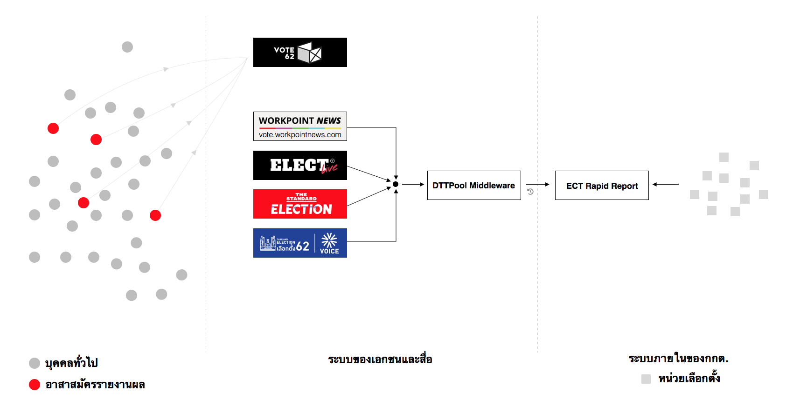

---
authors:
  - heytitle
---

# ภาพรวมทั้งหมดของระบบรายงานผลเลือกตั้ง

<author-list></author-list>

การเลือกตั้งในวันที่ 24 มี.ค. 2562 นั้น
เราได้เห็นพัฒนาการของสื่อที่ได้จัดทำเว็บไซต์เพื่อนำเสนอผลการนับคะแนน ให้บุคคลทั่วไปสามารถเข้าถึง และดูข้อมูลสรุปได้ในหลายๆ รูปแบบ
โดยเว็บไซต์เหล่านี้ส่วนใหญ่ใช้ผลการนับคะแนนจาก กกต.​ ยกเว้น Vote62 ที่ใช้หลักการของ Crowdsourcing ที่ให้อาสาสมัครร่วมกันกรอกข้อมูลลงไป

ELECT Live! และเว็บไซต์รายงานผลเจ้าอื่นๆ
ใช้ข้อมูลผลการนับคะแนนจาก กกต.​
ซึ่งดึงข้อมูลผ่านทางระบบที่ชื่อ DTTPool Middleware
ซึ่งเป็นระบบที่เอกชนรายหนึ่งเป็นผู้รับผิดชอบจัดทำ [^1]
โดยตัวระบบ DTTPool นี้
จะทำหน้าที่ดึงข้อมูลทุกๆ ช่วงเวลาหนึ่ง เช่น 2 นาที ต่อครั้ง เป็นต้น จาก ระบบ Rapid Report ของกกต.
แล้วเอามาเผยแพร่ให้เว็บไซต์สื่ออีกทอดหนึ่ง
ในส่วนของตัวระบบ Rapid Report นั้น คือระบบที่ กกต. จัดทำขึ้นเพื่อให้เจ้าพนักงานตามหน่วยเลือกตั้งสามารกรอกข้อมูลการนับคะแนนผ่าน Mobile Application เข้าสู่ฐานข้อมูลการนับคะแนนได้โดยตรง [^2]
ซึ่งในการเลือกตั้งครั้งนี้จำนวนเลือกตั้งมีประมาณ 90,000 หน่วย

บทความนี้จะพูดถึงการพัฒนา ELECT Live! เป็นหลัก
โดยเนื้อหาและแหล่งข้อมูลเกี่ยวกับเรื่องอื่นๆ สามารถดูเพิ่มเติมได้ที่โปรเจค [awesome-election-62](https://github.com/codeforthailand/awesome-election-62)

[^1]: <https://www.facebook.com/killernay/posts/10156173949109013>
[^2]: <https://www.isranews.org/isranews-news/75056-isranews-75056.html>
