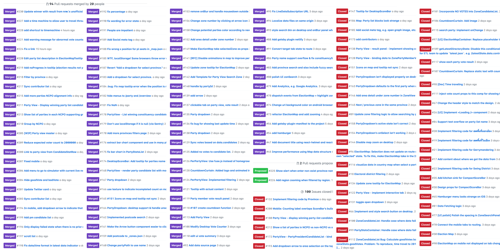
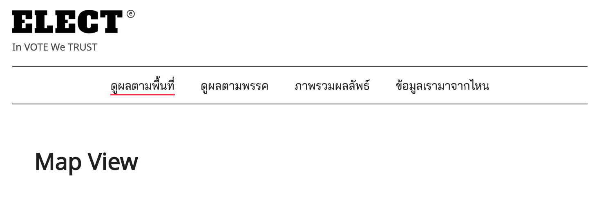
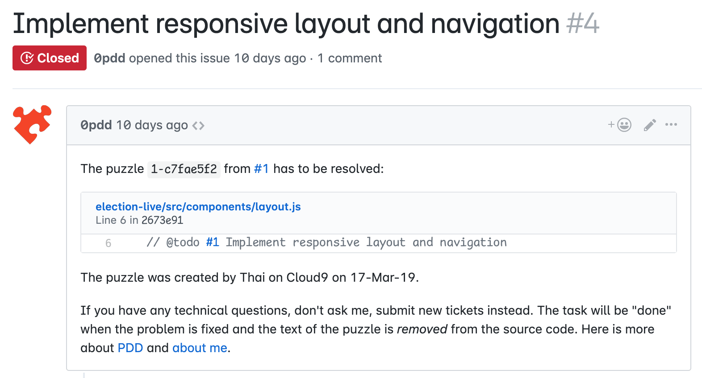
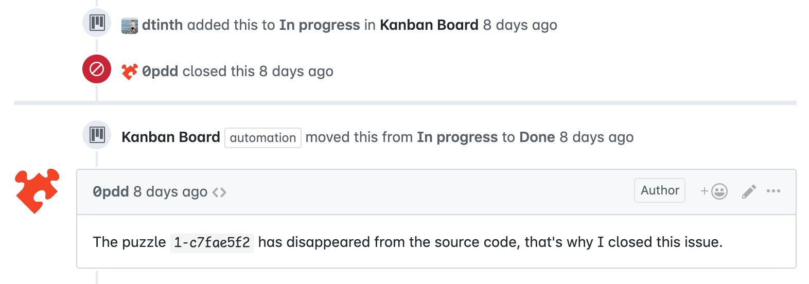
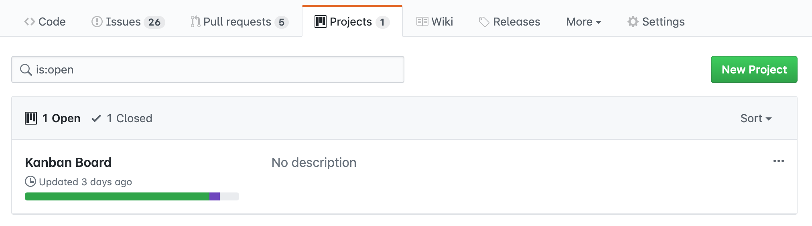
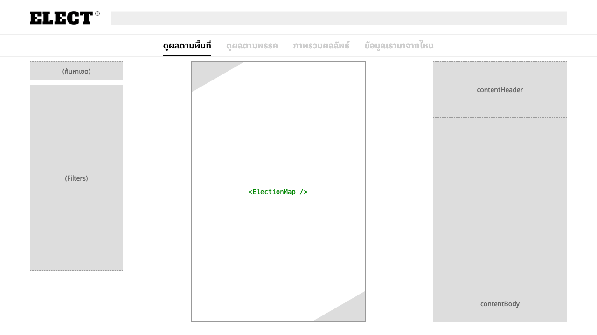
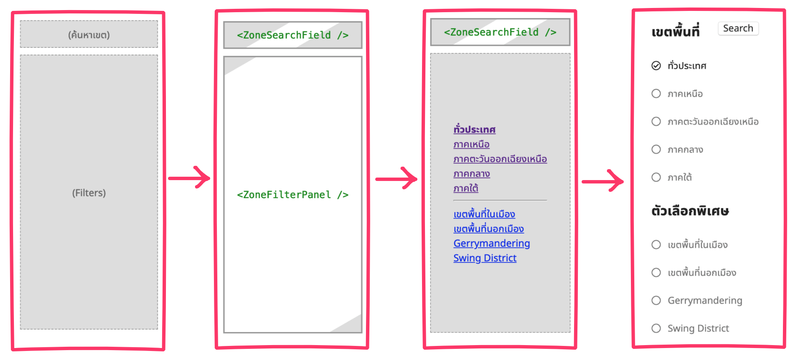

---
authors:
  - dtinth
---

# แบ่งงานใหญ่ๆ เป็นงานย่อยๆ ด้วย Puzzle-Driven Development

<author-list></author-list>

ปกติเวลาทำ Software
เราก็มักจะแบ่งงาน และดูความคืบหน้าโดยการนำ Project management tool เข้ามาช่วย
ในขณะเดียวกัน ส่วนที่ยังเขียนไม่เสร็จ ก็มักจะใส่คอมเม้นต์ `// TODO` ไว้
ซึ่งปัญหาที่มักเกิดขึ้นบ่อยๆ โดยเฉพาะกับโปรเจกต์ที่มีเวลาน้อยๆ คือ

- โฟกัสกับการทำงานจนลืมมาอัพเดตสถานะกัน
  กลายเป็นไม่มีใครรู้ว่าตกลงงานไหนทำถึงไหนไปแล้ว
- พองานมันใหญ่ก็หายไปนาน
  เสร็จแล้วก็ส่งโค้ดชุดใหญ่มาตู้มเดียว
  แล้วก็เกิด Merge conflict กระจาย
  นอกจากนี้ปัญหาการรวมโค้ด
  แต่ละคนก็เขียนโค้ดไปคนละทิศคนละทางกัน ไม่สามารถส่งงานต่อกันได้
- เขียน TODO comment ทิ้งไว้ แล้วก็ปล่อยไว้อย่างนั้น
  ไม่มีใครมาทำอะไรกับมันต่อ
  ทิ้งไว้เป็นปีๆ แล้วค่อยมาแก้ตอนเกิดวิกฤต
  เหมือนเป็นระเบิดเวลา

## Puzzle Driven Development ช่วยให้เราสามารถปิด 100 issue ได้ภายใน 8 วัน

[**Puzzle Driven Development**](https://www.yegor256.com/2010/03/04/pdd.html) เป็นเทคนิคการพัฒนาซอฟต์แวร์ ที่คิดค้นโดย Yegor Bugayenko
ซึ่งเหมาะสำหรับทีมที่มีการกระจายตัวมากๆ ไม่สามารถมาเจอหน้ากันได้ตลอดเวลา ([XDSD: eXtremely Distributed Software Development](https://www.xdsd.org/))

ซึ่งก็ค่อนข้างเป็นสถานการณ์ที่ทีม ELECT Live! กำลังเผชิญอยู่
คือมีเวลาแค่ 8 วัน
และอาสาสมัครนักพัฒนาแต่ละคน ก็อยู่กันคนละบริษัท บางทีก็คนละจังหวัด บางทีก็คนละประเทศ

สำหรับโปรเจกต์นี้ผมจึงลองนำ Puzzle Driven Development มาใช้ดู
ซึ่งก็ได้ผลดีเกินคาด — ภายใน 8 วันนี้เราปิด Issue ไปนับร้อย




---

## แปลง TODO เป็น Issue

สมมุติว่าคุณต้องขึ้นหน้าเว็บ แล้วคุณมีเวลาอยู่แค่ 1 ชั่วโมง
คุณจะทำยังไง?

สิ่งที่พอจะทำได้ก็คือ
ก็เขียนโค้ดเท่าที่ทำได้ แล้วตรงไหนที่ยังทำไม่เสร็จก็ใส่ TODO ไว้



ตัวอย่างเช่น
ตอนแรกที่ผมทำ Navigation Bar ผมพัฒนาใน Desktop
ก็เลยยังไม่ได้ทำให้มันใช้ในมือถือได้
แต่เราก็รู้ตัวว่ามันยังไม่เสร็จ ก็ใส่ `// @todo` ไว้ ว่าตอนนี้หน้าเว็บยังไม่เป็น Responsive และควรจะแก้

```js{6}
import React from "react"
import "../styles/global.css"
import GlobalPanel from "./GlobalPanel"
import NavBar from "./NavBar"

// @todo #1 Implement responsive layout and navigation
export default function Layout({ children }) {
    return (
    <React.Fragment>
        <div css={{ margin: "13px 16px" }}>
```

ทันทีที่ผม Push โค้ดนี้ขึ้นไปบน GitHub
จะมีบอท [0pdd](http://www.0pdd.com/) ที่จะเข้ามาสแกนโค้ด
แล้วหา `// @todo` เพื่อเอาไปสร้างเป็น issue



ภายหลัง เมื่อผมกลับมาทำ Navigation Bar ให้มันเป็น Responsive ได้แล้ว
พอผมเอา `// @todo` ออก
บอท 0pdd ก็จะมาปิด Issue ให้โดยอัตโนมัติ



พูดง่ายๆ ก็คือ
เราจัดการงานกันผ่านคอมเม้นต์ `// @todo` ที่อยู่ในโค้ด
คือให้ Source of truth ของงานที่จะต้องทำ อยู่ในตัวโค้ดไปเลย
แล้วใช้ GitHub Issue เป็นตัวรายงานภาพรวมแล้วมีอะไรที่ต้องทำบ้าง และใช้สื่อสารกันภายในตัวงาน

นอกจากนี้หากเราใช้ GitHub Projects แล้วตั้งระบบ Automation ไว้ เราจะสามารถดูความคืบหน้าของโปรเจ็คได้เลย



## การใช้ PDD ช่วยให้แตกงานได้อย่างละเอียด

ตอนที่ผมทำ Layout หน้าเว็บ
แทนที่ผมจะขึ้นเว็บทั้งหน้า ผมก็สร้างโครงแบบนี้ไว้แทน
แล้วใส่คอมเม้นต์ `// @todo` เข้าไป



เท่านี้ **1 งานใหญ่ๆ ก็ถูกแตกออกเป็น 7 งานย่อยๆ**
ที่สามารถทำไปพร้อมกันได้ และคนอื่นสามารถมาช่วยได้ด้วย

## จำกัดเวลาทำงานของแต่ละทาส์ก เพื่อให้สามารถแตกงานได้ดีขึ้น

หากเราต้องใช้เวลากับงานงานนึงมากจนเกินไป
บางทีมันอาจจะหมายความว่า งานนั้นมันใหญ่เกินไป และควรจะย่อยออกเป็นงานเล็กๆ กว่านี้ก็ได้

การเลือกที่จะจำกัดเวลาในการทำทาส์กสักอย่างให้น้อยๆ (เช่น ไม่เกิน 1 ชั่วโมงต่อทาส์ก)
แล้วก็ทิ้งจุดที่เหลือที่ยังทำยังไม่เสร็จไว้เป็น TODO ที่อาจจะกลับมาทำทีหลังระหว่างที่เราต้องไปทำอย่างอื่นที่สำคัญและเร่งด่วนกว่า
บางครั้งอาจจะมีคนที่ยินดีพร้อมที่จะมาช่วยเราทำในส่วนนั้นต่อก็เป็นได้

การเลือกที่จะไม่ทำงานทั้งหมดให้เสร็จในทีเดียว สามารถช่วยให้เราแบ่งงานกันได้ดีขึ้น สามารถส่งงานต่อให้คนอื่นได้ง่ายขึ้น



## ตัวอย่างงานที่แบ่งละเอียดจนมีคนช่วยกันทำได้ 5 คน

คอมโพเนนต์ ZoneSearchPanel เป็นตัวอย่างหนึ่งที่น่าสนใจ เพราะว่าผ่านมือมาประมาณ 5 มือ

คอมโพเนนต์นี้ ใช้สำหรับหาเขตเลือกตั้ง
โดยผู้ใช้สามารถพิมพ์**ชื่อจังหวัด ชื่อเขต หรือรหัสไปรษณีย์**
เพื่อค้นหาเขตเลือกตั้งที่ต้องการดูข้อมูลได้

- เริ่มจาก [@heytitle ทำช่อง Search เวอร์ชั่นแรก](https://github.com/codeforthailand/election-live/commit/75a5168e9ebe2f7b6ea05118c852c1d77e51250d) ที่หาได้ตามชื่อตำบล/ชื่อเขต
  - แต่ยังหาด้วยชื่อจังหวัดและรหัสไปรษณีย์ไม่ได้ ([#69](https://github.com/codeforthailand/election-live/issues/69))
    - @iboss-ptk ทำให้หาด้วยชื่อจังหวัดได้ และนำระบบ Fuzzy search มาใช้ ([#83](https://github.com/codeforthailand/election-live/pull/83))
      - แต่ยังหาด้วยรหัสไปรษณีย์ไม่ได้ ([#89](https://github.com/codeforthailand/election-live/issues/89))
        - @whs ทำให้หาด้วยรหัสไปรษณีย์ได้ ([#162](https://github.com/codeforthailand/election-live/pull/162))
  - แต่เมื่อเลือกแล้วยังไม่ได้ลิงก์ไปหน้าเขตนั้น
    - @dtinth ทำให้ลิงก์ไปหน้าของเขตเลือกตั้งได้ ([commit](https://github.com/codeforthailand/election-live/commit/2a8442990f708d260928c024c5101eb444447189#diff-cbd2e9549e51c2e6e0e938959f7c9474))
  - แต่หน้าตายังไม่เหมือนใน Design ซะทีเดียว ([#77](https://github.com/codeforthailand/election-live/issues/77))
    - @gminemini ช่วยปรับ UI ให้ตรงตามที่ design ([#80](https://github.com/codeforthailand/election-live/pull/80))

ความเจ๋งคือมีคนจากทุกระดับประสบการณ์มาช่วยกันทำ

- น้องบางคนเพิ่งจบมาได้ไม่นาน และยังแทบไม่เคยเขียน React เลย
  ได้ฝึกใช้ React และฝึกทำงานกับคนอื่นโดยใช้ GitHub ผ่านโปรเจกต์นี้
- อีกคนก็มีสกิลด้าน Process ข้อมูล เพื่อสร้าง Mapping ระหว่างรหัสไปรษณีย์และเขตการเลือกตั้ง
- อีกคนก็รู้ไลบรารี่ที่ใช้สำหรับทำ Fuzzy search

ถ้าผมแบกคอมโพเนนต์นี้ไว้ทำคนเดียว คงเหนื่อย ใช้เวลานาน และคงไม่ออกมาดีแบบนี้
จะเห็นว่าการปล่อยงานที่ไม่เสร็จสมบูรณ์ทิ้งไว้ก่อน อาจจะช่วยเปิดโอกาสให้คนอื่นได้มาลองร่วมพัฒนากับเราได้มากขึ้น
