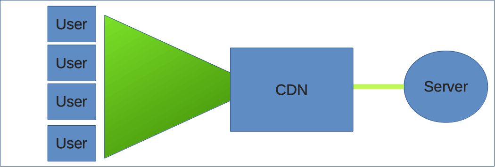
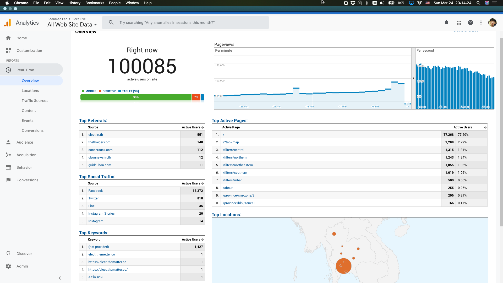
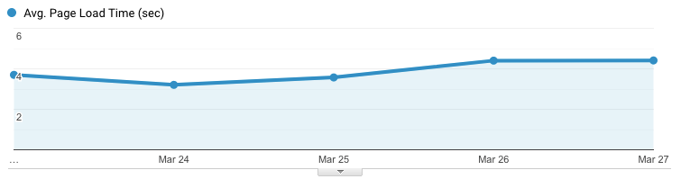
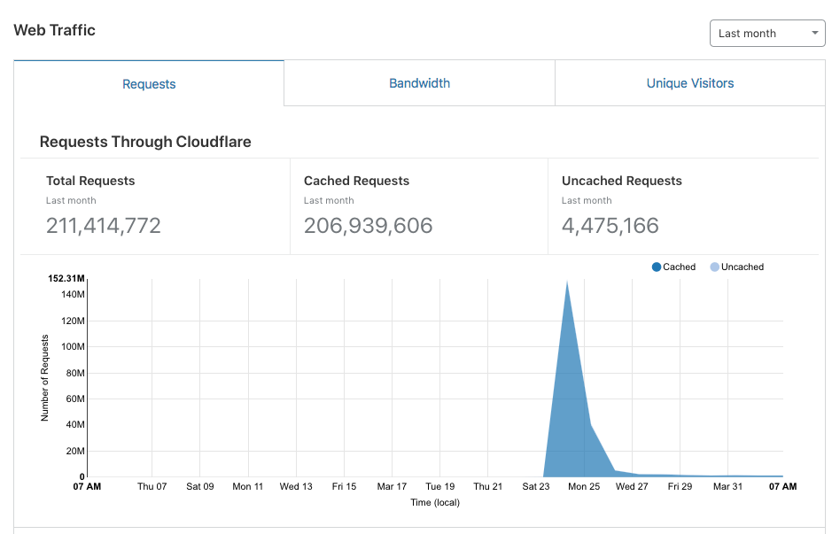
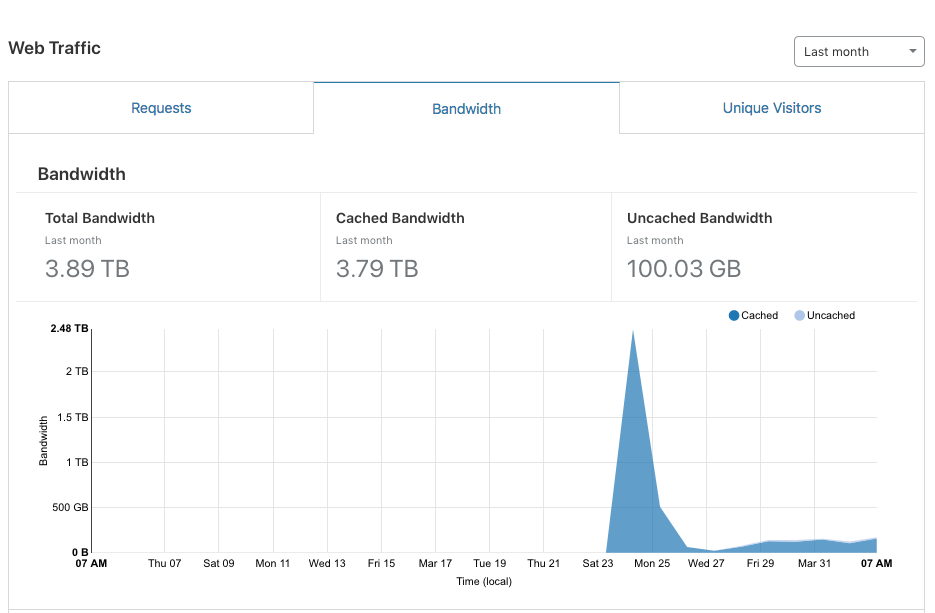
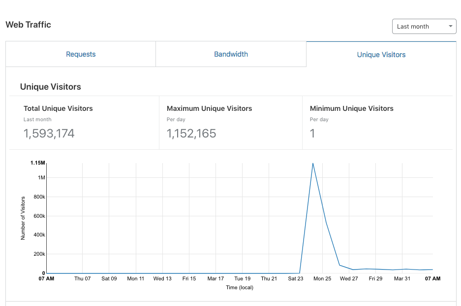

---
authors:
  - mishari
---

# เตรียมรับ Traffic เยอะๆ ด้วย Static files และกลยุทธ์ caching

<author-list></author-list>

เวลาเราออกแบบระบบ
เราต้องคำนึงถึงการที่เว็บด้านหน้าต้องรองรับจำนวนคนดูที่มหาศาลและคาดการณ์จำนวนผู้เข้าชมไม่ได้
ถ้าจะเปรียบเทียบว่าหน้าเว็บคือละคร ทุกครั้งที่เปิดรอบ จำนวนคนที่โรงหนังรองรับได้มีจำกัด
ถ้าจะเพิ่มรอบการแสดงต้องทำอย่างไร? ต้องฝึกนักแสดงเยอะๆ แล้วกระจายออกไปตามโรงละครต่างๆ

การแสดงก็เปรียบเสมือนการทำงานเบื้องหลังของเว็บไซต์เพื่อที่จะสร้างหน้าเว็บขึ้นมาในแต่ละครั้ง
ซึ่งทำให้การขยายตัวเพื่อรองรับจำนวนผู้เข้าชมเยอะๆ นั้นทำได้ค่อนข้างยาก
แต่กลยุทธ์ในที่นี้คือการอัดภาพการแสดง และถ่ายทอดออกไป
ซึ่งทำได้ง่ายกว่าการสร้างนักแสดงขึ้นมาใหม่

วิธีที่เราทำก็คือเราได้แบ่งการประมวลผลออกเป็นสองส่วนด้วยกัน

1. ส่วนแรกจะเป็นส่วนที่ติดต่อกับระบบของ กกต.
   มีการดึงข้อมูลลงมาในระบบหลังบ้านแล้วประมวลตรงนั้นเลย
   เสร็จแล้วก็เอาข้อมูลคงที่ (.json) รวมถึงข้อมูลเว็บไซต์ (.html, .css, .js, ไฟล์ภาพ) โยนไปไว้บน server
   เพื่อให้ Content Delivery Network (CDN) ดึงแล้วทำการกระจายออกไป
2. มีระบบการประมวลผลหน้าบ้านที่อยู่ฝั่งของผู้ใช้ที่ดึงข้อมูลจาก CDN
   และประมวลผลเป็นภาพให้ผู้ใช้เห็นได้อย่างสวยงาม

ระบบ CDN เป็นระบบเฉพาะกิจที่ใช้ในการกระจายเนื้อหาบนอินเตอร์เน็ตด้วยประสิทธิภาพสูง
เราจะเห็นระบบ CDN ถูกใช้ในเว็บต่างๆ เช่น YouTube ที่ใช้ CDN ในการกระจายข้อมูลไปหาผู้ใช้
การที่เราได้ใช้ CDN ขั้นระหว่าง server กับ ผู้ใช้
ทำให้เราสามารถมี server spec ต่ำๆ แค่ตัวเดียว
ที่รองรับผู้ใช้เป็นแสนคนในเวลาเดียวกันได้



ทั้งนี้ทั้งนั้น เราต้องระมัดระวังว่าเวลาออกแบบสถาปัตยกรรมของระบบนั้น ข้อมูลทุกชิ้นส่วนต้องมาจาก CDN
และข้อมูลที่ CDN ดึงออกมาเป็นข้อมูลคงที่ (static data)
ทั้งนี้เพื่อในกรณีที่ CDN เผชิญปัญหา
เราสามารถเปลี่ยนกลยุทธ์ในการกระจายข้อมูลได้อย่างรวดเร็ว

เพื่อให้มีการอัพเดทข้อมูลในระยะเวลาที่เหมาะสม
เราได้มีการตรวจสอบข้อมูลใน server ทุกๆ 30 วินาที
เพื่อดูว่าข้อมูลได้มีการเปลี่ยนแปลงไหม
ถ้าไม่มีการเปลี่ยนแปลงก็ไม่จำเป็นต้องดึงข้อมูลชุดใหม่ออกมา
แต่ถ้ามีการเปลี่ยนแปลงก็ค่อยดึงออกมา
ส่วนในกรณีที่ server มีปัญหา หรือต้องมีการย้าย server อย่างเร่งด่วน
ก็มีการเซ็ทค่าไว้เพื่อให้ CDN ใช้ข้อมูลเก่าไปก่อน เพื่อให้ผู้ใช้ไม่ได้รับผลกระทบ
ทั้งหมดนี้ถูกคอนฟิกโดยใช้ค่าต่อไปนี้ใน htaccess

```
public, max-age=30, stale-while-revalidate=30, stale-if-error=300, must-revalidate
```

ซึ่งแปลว่า:

- `public` - ข้อมูลสาธารณะ (ไม่ได้เปลี่ยนแปลงเป็นรายบุคคล)
  อนุญาตให้ CDN ทำการ cache ได้

- `max-age=30` - ระบุอายุสูงสุดของไฟล์ใน cache ซึ่งในกรณีนี้ห้ามเกิน 30 วินาที

- `stale-while-revalidate=30` - หลังจากที่หมดอายุแล้ว
  ในขณะที่ CDN กำลังดึงไฟล์ใหม่อยู่
  เราจะให้ CDN สามารถใช้ไฟล์เก่าต่อเป็นเวลาอีก 30 วินาที
  คอนฟิกนี้ใช้เผื่อ server ในขณะนั้นมีโหลดหนัก หรือเน็ตเวิร์คช้า ทำให้ส่งไฟล์ใหม่มาไม่ทัน

- `stale-if-error=300` - ในกรณีที่ server มีปัญหา
  CDN สามารถใช้ไฟล์ที่อยู่ใน cache ต่อไปได้อีก 5 นาที
  เผื่อต้อง reboot server

- `must-revalidate` - ในกรณีที่ไฟล์ใน CDN หมดอายุ อย่าส่งไฟล์ไปหาผู้ใช้โดยที่ไม่ได้ตรวจสอบก่อนว่าไฟล์มีการอัพเดทหรือไม่ และดึงไฟล์ใหม่เข้ามาในระบบ CDN

เนื่องจากว่าโครงการนี้มีงบประมาณ 0 บาท
เราไม่มีงบประมาณที่จะซื้อบริการจาก CDN เฉพาะทาง
เพราะฉะนั้นเราได้ไปใช้บริการของ CloudFlare ซึ่งไม่ได้มีประสิทธิภาพสูงเท่า CDN บางเจ้า
แต่สามารถใช้บริการได้ **free**
ตราบใดที่เราไม่ได้ใช้ฟังค์ขั่นที่ advance ขึ้นมา
ซึ่งโปรเจ็กต์นี้ไม่ได้ใช้

หลังจากที่คอนฟิกเสร็จแล้ว ต้องมีการ test
ซึ่งเราได้ทำการ test ดังนี้:

- บน Server:

  ```
  watch -n1 'date > output.json'
  ```

- บน Client

  ```
  watch -n1 curl -sv https://cdn-server/output.json
  ```

Command บน server จะเขียนเวลาปัจจุบันลงไปในไฟล์ `output.json` ทุกๆ 1 วินาที
ส่วน command ที่สองจะทำการดึงไฟล์กลับออกมาจาก CDN
ถ้าทุกอย่างทำงานอย่างสมบูรณ์
เราจะเห็น command ชุดที่สองแสดงเวลาที่มีการเปลี่ยนทุกๆ 30 วินาทีเท่านั้น
(เพราะอย่างที่เขียนเอาไว้ด้านบน cdn server จะดึงไฟล์ทุกๆ 30 วินาที)

ครั้งแรกที่มีการรันคำสั่งนี้
ปรากฎว่าไฟล์มีการเปลี่ยนแปลงทุกๆ หนึ่งวินาที
พอสืบดูปรากฎว่ามีการคอนฟิก CDN ผิดไป ก็เลยลองใหม่
หลังจากนั้นใช้งานได้ตามปกติ

เนื่องจากว่าไฟล์ทั้งหมดจะถูกส่งผ่าน CloudFlare
เราคิดว่าการทำ capacity testing หรือทดสอบข้อจำกัดของปริมาณผู้ใช้งานไม่สามารถทำได้
เพราะ CloudFlare จะมีการบล็อกระบบการจำลองผู้ใช้อัตโนมัติ
แต่เนื่องจากว่า CloudFlare เป็นผู้ให้บริการรายใหญ่เพราะฉะนั้นเราไม่มีทรัพยากรณ์เพียงพอที่จะทดสอบระบบของเขาจนถึงขีดจำกัด
เราได้ประเมินว่ามีโอกาสรองรับการใช้งานได้ค่อนข้างสูง
ครั้งนี้เราเลยไม่ได้ทำ capacity test

กลยุทธ์นี้ได้ผล
CloudFlare สามารถรองรับผู้ใช้ได้แสนกว่าคนในเวลาเดียวกัน และผู้ใช้งานไม่ได้เจอปัญหาใดๆ ทั้งสิ้น










