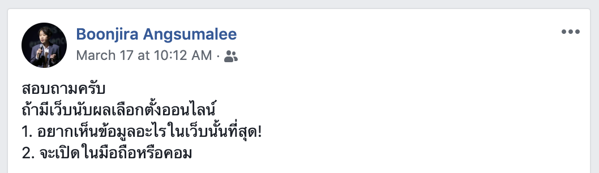

---
authors:
  - dtinth
---

# อย่าลืมสำรวจผู้ใช้ก่อนเริ่มพัฒนา

<author-list></author-list>

ในวันที่เรามาประชุมเรื่องโปรเจกต์ ELECT Live! กันครั้งที่ 2
ก็มีการคุยกันในประเด็นที่ว่า
เราควรจะแสดงข้อมูลอะไรบ้าง และแสดงอย่างไร รวมถึงว่าเราจะทำเว็บเน้นให้ดูบนเดสก์ท็อปหรือบนมือถือ

ก็มีการคุยถึงข้อดีข้อเสียกัน แต่น้องอ้อ (BA) ได้ทำการบ้านมาล่วงหน้าเรียบร้อยแล้ว โดยโพสต์สี่บรรทัดนี้ลงบนเฟสบุ๊กส่วนตัว

พบว่า คนส่วนใหญ่อยากจะดูข้อมูล จำนวน ส.ส. รวมทั้งประเทศ และดูข้อมูลของเขตตัวเอง และเกือบทั้งหมดบอกว่าจะเปิดดูบนมือถือ
เป็นข้อมูลที่ชัดเจนใช้ได้เลย

สุดท้ายผลก็ออกมาตามนั้นจริงๆ
คนเกิน 90% เปิดดูบนมือถือ และ 40% ของเพจวิวทั้งหมด คือหน้าแสดงผลข้อมูลรายเขต

ที่ผมอยากเขียนหัวข้อนี้ เพราะพบว่าในเวลาการทำงานจริงๆ นอกโปรเจคนี้
หลายครั้งมากที่ทีมออกแบบและทีมพัฒนามักจะเถียงกันยาวๆ ว่าจะออกแบบยังไงดี ให้ผู้ใช้ถึงสามารถใช้ได้ง่ายที่สุด ซึ่งต่างคนก็ต่างเหตุผลกันไป
ทั้งๆ ที่บางครั้ง เราอาจหาคำตอบนี้ได้ด้วยโพสต์เพียง 4 บรรทัด
