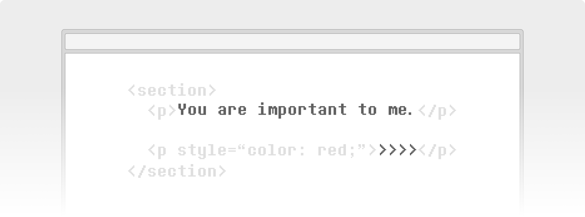
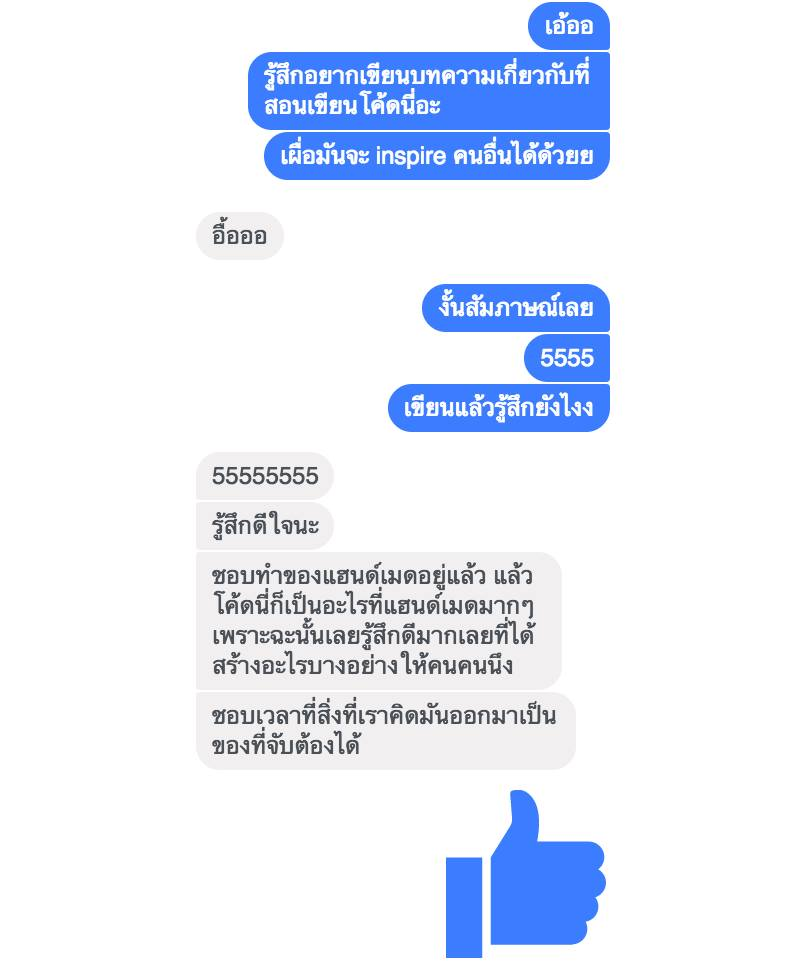

# Programming and motivation

> บทความนี้[เดิมทีเขียนไว้บนเฟสบุ๊คเมื่อวันที่ 14 มีนาคม 2017](https://web.facebook.com/notes/10215701124355305/)
> ย้ายมาที่เว็บนี้เพราะเฟสบุ๊คปิดตัวระบบโน้ตไปแล้ว

ในช่วงเดือนที่ผ่านมา
มีการแชร์เรื่องปัญหา ‘วิกฤติโปรแกรมเมอร์ขาดตลาด’ เต็มเฟสบุ๊ก
คนที่จบสายคอมพิวเตอร์ส่วนมากไม่อยากเขียนโค้ด เกลียดการเขียนโปรแกรม ฯลฯ
ผมเชื่อว่าคำตอบอยู่ที่ “แรงจูงใจ” (motivation) ซึ่งเป็นสิ่งที่ทำให้เรามีกำลังในการก้าวข้ามปัญหาต่างๆ
ไม่นานมานี้ผมก็ได้ลองทดสอบแนวคิดนี้ซะที



หลังจากคบกันมาเกือบสี่ปี ผมกับแฟนเก่าก็ตกลงกันว่าเป็นแค่เพื่อนกันดีกว่า เราเลยเลิกเป็นแฟนกันด้วยดี
เรายังติดต่อกันและเจอกันเป็นครั้งคราว
เวลาเพื่อนรู้ว่าผมไปเจอเธอผมก็มักจะโดนแซว และโดนถามว่าจะรีเทิร์นไหม ซึ่งผมก็ตอบแบบเดิมตลอดว่า `return false`

ปกติเวลาเจอกัน ผมก็มักจะชวนคุยเรื่องการเขียนโปรแกรม และชีวิตของนักพัฒนาซอฟต์แวร์ (ก็คุยเรื่องอื่นไม่เป็น)
ผมเล่าให้เธอฟังถึงเรื่องวิกฤตโปรแกรมเมอร์ และแนวคิดของแรงจูงใจ

ผมเล่าให้ฟังว่าเคยได้รับเชิญไปประชุมเกี่ยวกับหลักสูตรวิศวกรรมซอฟต์แวร์
ในที่ประชุมผมก็พูดถึงเรื่องนี้นี่แหละ ผมบอกว่า “อยากเห็นนิสิตเรียนจบเทอมแรกแล้วสามารถเขียนแอปง่ายๆ ไว้ใช้เองได้” จะได้มีของไว้อวดเพื่อน อวดให้พ่อแม่ดู
แต่ดูเหมือนว่าที่ประชุมจะให้ความสนใจกับว่าจะเอาวิชาไหนไว้เทอมไหนกันมากกว่า

สมัยที่ผมหัดเขียนโค้ด ผมใช้โปรแกรมง่ายๆ เช่น Visual Basic ลากๆ วางๆ พิมพ์โค้ดสามสี่บรรทัด ก็ได้โปรแกรมง่ายๆ เอาไปโชว์ให้พ่อแม่ดูแล้วว่าเขียนโปรแกรมได้

---

พอเห็นบรรยาศที่นิสิตเรียนเขียนโปรแกรมกันก็รู้สึกเศร้าขึ้นมา
นี่มันอะไร เทอมแรกทั้งเทอมทำได้แค่เขียนโปรแกรมในคอนโซลดำๆ… วันๆ ทำแต่ `Console.ReadLine()` กับ `Console.WriteLine()` เป็นอะไรที่ดูจับต้องไม่ได้เลย… แถมทั้งยาก และน่าเบื่ออีกต่างหาก
ถ้าจบวิชานี้แล้วจะเกลียดโปรแกรมมิ่งก็คงไม่แปลก

ผมเคยคิดเล่นๆ ว่าอยากลองจัดกิจกรรมสำหรับน้องที่เพิ่งเข้ามหาวิทยาลัย
แทนที่จะมานั่งหัวระเบิดกับ for-loop หรือ recursion (ซึ่งหลังๆ ผมมองว่าการทำแบบนี้เป็นการบั่นทอนกำลังใจอย่างยิ่ง)
ให้มาลองสร้างโปรแกรมง่ายๆ กันแทน จะได้รู้สึกว่าตัวเองเป็นพ่อมดแม่มดเสกโค้ดได้ เหมือนที่ผมรู้สึกมาตลอด

ดราม่ายาวละ กลับเข้าเรื่องดีกว่า

---

ปีนี้เธอเล่าให้ผมฟังถึงเรื่องที่เธอกำลังชอบคนคนนึงอยู่…
แล้ววันหนึ่งเธอก็โทรมา บอกว่าอยากลองเขียนโปรแกรมดู
อยากลองทำของขวัญวันวาเลนไทน์ให้เขาคนนั้น จึงอยากให้ผมสอนให้
เธอถามว่า “ถ้าเราอยากสร้าง URL ขึ้นมาอันนึง แล้วพอส่งให้เขา ก็จะขึ้นข้อความต่างๆ ที่เราเขียนให้ มันทำยากไหม”

ในที่สุดผมก็จะได้ลองสอนเขียนโปรแกรมเบื้องต้นซะที
ผมตอบตกลงทันที พร้อมบอกให้เธอโหลดโปรแกรม Atom และ Google Chrome และให้คิดด้วยว่าจะอยากจะบอกอะไรเขาบ้าง

เธอเรียนอยู่คณะเศรษฐศาสตร์ แทบไม่มีประสบการณ์เรื่องการเขียนโค้ดเลย นอกจากที่เคยเรียนในช่วงมัธยมต้น
เธอโทรมาวันที่ 9 กุมภาพันธ์ นั้นหมายความว่าผมมีเวลาประมาณ 3 วันที่จะสอนให้เธอเขียนเว็บได้…
น่าตื่นเต้นดีนะ

<!-- prettier-ignore-start -->

## วันแรก

วันแรก
ผมสอนให้ลองเขียนเว็บแบบง่ายๆ
เริ่มจากเปิด Atom แล้วสร้างไฟล์ `index.html`

```html{1}
<h1>Happy Valentine's Day</h1>
```

ผมให้เธอลองเปลี่ยนจาก `h1` เป็น `h2` \
แล้วสังเกตว่าเกิดอะไรขึ้น \
ให้ลองสร้างแท็ก `p` ลองใส่เนื้อหาง่ายๆ ดู

```html{1-2}
<h2>Happy Valentine's Day</h2>
<p>Thanks for the gifts</p>
```

ผมให้เธอลองเปลี่ยนสีหน้าเว็บดู \
ผมสอนให้ใช้ Inline style นี่แหละ เพราะมันง่ายกว่า

```html{1-2}
<body style="background:black;color:white">
<h2 style="color:yellow">Happy Valentine's Day</h2>
<p>Thanks for the gifts</p>
```

ผมเริ่มเกริ่นถึงภาษา CSS \
ว่าตอนนี้เธอเริ่มเขียนภาษา CSS ได้แล้ว \
ตอนที่พิมพ์คำสั่งใน `style="..."` นี่แหละ \
ตอนนี้คือกำลังเขียนภาษา CSS อยู่

ผมอธิบายว่าเวลาทำเว็บกันจริงๆ \
เขาไม่ทำแบบนี้กัน (ไม่ใช้ Inline style) \
แต่จะแยกโค้ดเป็นไฟล์ภาษา HTML, CSS, JavaScript ให้เรียบร้อย

ผมโชว์โค้ดตัวอย่างของเว็บไซต์อื่นๆ ให้ดู \
ผมให้เธอลองเล่นกับ Developer Tools ใน Chrome \
เมื่อเธอสงสัยอะไร ผมก็บอกให้ลอง Inspect ดู \
ผมสอนเธอสร้างโปรเจกต์ใน Firebase Hosting

```cmd
C:\Users\USER> cd Desktop
C:\Users\USER\Desktop> cd Programming
C:\Users\USER\Desktop\Programming> npm install -g firebase-cli
C:\Users\USER\Desktop\Programming> firebase login
C:\Users\USER\Desktop\Programming> firebase init
C:\Users\USER\Desktop\Programming> firebase deploy
```

แล้วหน้าเว็บนั้นก็ขึ้นไปอยู่บนโลกของอินเทอร์เน็ต

ผมให้เธอลองแก้โค้ด \
แล้วลอง Deploy ขึ้นไปใหม่ \
ทำซ้ำหลายๆ ครั้งจะได้จำได้

แล้วผมก็ให้การบ้าน — ให้ลองเข้า W3Schools และให้ไปลองอ่านเกี่ยวกับ HTML และ CSS แบบผ่านๆ ดู
และที่สำคัญ ให้ออกแบบมาด้วยว่าอยากจะให้มีเนื้อหาอะไรในหน้าเว็บนั้นบ้าง

## วันที่สอง

วันที่สอง
เธอมาพร้อมกับสมุดโน้ต \
เธออธิบายให้ฟังว่าเธอต้องการทำเว็บให้เป็นหน้าๆ \
บางหน้าต้องใส่รหัสผ่านให้ถูก \
บางหน้าต้องตอบคำถามให้ถูก \
บางหน้ามีข้อความ แล้วก็มีปุ่ม Next ให้กด \
บางหน้าก็มีรูป

ผมจึงให้เธอลองแบ่ง Section เป็นหน้าต่างๆ แล้วก็ใส่เนื้อหาไปให้หมดก่อน
ยังไม่ต้องคิดถึงเรื่องการตอบโต้ การเช็ครหัสผ่าน ปุ่ม Next หรืออะไรทั้งนั้น
ทำให้เนื้อหาทั้งหมดที่ต้องการสื่อปรากฏบนจอให้ได้ก่อนดีกว่า
อย่างน้อยถ้าทำไม่ทัน ก็ยังสื่อความได้ครบถ้วน

```html
<section style="margin-top:200px;text-align:center">
  <p>รหัสผ่าน: <input type="text"></p>
</section>
<section style="margin-top:200px;text-align:center">
  <p><strong>นี่คุณจริงรึเปล่านะ</strong></p>
  <p>ถ้าใช่ก็ต้องตอบคำถามนี้ได้</p>
  <p>a) คำตอบที่ 1<br>b) คำตอบที่ 2<br>c) คำตอบที่ 3<br>d) คำตอบที่ 4</p>
</section>
<section style="margin-top:200px;text-align:center">
  <p><strong>คุณจริงๆ ด้วย!</strong></p>
  <p style="text-align:right">next</p>
</section>
<section style="margin-top:200px;text-align:center">
  <p>เราเพิ่งหัดเขียนโค้ด ก็เลยอยากเขียนโปรแกรมแรกให้แหละ</p>
  <p style="text-align:right">next</p>
</section>
<section style="margin-top:200px;text-align:center">
  <p>จำได้ไหมตอนนั้นที่เรา…
```

ผมบอกว่า style มันซ้ำกันมาก \
พร้อมสอนให้เธอเขียน CSS ในแท็ก `<style>` \
และสอนถึงโครงสร้างของ HTML ที่ถูกต้อง

```html{4-6,12}
<!DOCTYPE html>
<html>
<head>
<style>
.page { margin-top: 200px; text-align: center; }
</style>
</head>
<body>

...

<section class="page">
...
```

ผมอธิบายถึงการใช้ `<!DOCTYPE html>` ว่า

<blockquote>

สมัยก่อนภาษา HTML ยังใหม่ๆ อยู่ มาตรฐานจึงยังไม่ครอบคลุม
เบราว์เซอร์ต่างๆ ก็แข่งกันพัฒนาใส่ความสามารถต่างๆ ที่นอกเหนือจากมาตรฐานของภาษา HTML ยุคแรกๆ เข้าไป
แต่ละเบราว์เซอร์จึงตีความโค้ด HTML กันไปคนละแบบ
ในช่วงต่อมาได้มีการทำให้เป็นมาตรฐานขึ้น
แต่ปัญหาคือเว็บเก่าๆ กลับใช้งานไม่ได้
เพราะถูกเขียนขึ้นในสมัยที่ยังไม่เป็นมาตรฐาน
จึงเกิดเป็นโค้ด `<!DOCTYPE html>` เพื่อระบุว่าหน้าเว็บนี้อิงจากมาตรฐาน HTML

</blockquote>

เธอนั่งใส่ข้อความต่อไป
บางจุดเธอก็อยากจะจัดรูปแบบให้สวยงาม
แต่ผมก็แนะนำให้ใส่เนื้อความที่อยากจะสื่อให้หมดก่อน แล้วค่อยเก็บรายละเอียดทีหลัง

“Done is better than perfect”

ผมอ่านเนื้อความไปก็ฟินไป \
ในขณะเดียวกันเธอก็พิมพ์ไปยิ้มไป \
ด้วยความดีใจที่เห็นข้อความปรากฏบนหน้าจอ \
และแล้วเธอก็เขียนเนื้อความที่อยากจะสื่อจนครบ

“เอาล่ะ เดี๋ยวเราจะทำให้โชว์ทีละหน้ากัน”
ผมให้เธอสร้างคลาสไว้ซ่อนเนื้อหา

```css{1}
.hide { display: none; }
```

พร้อมทั้งให้ซ่อนหน้าที่เหลือออกให้หมด
และใส่ ID ให้แต่ละหน้า

```html{1,4,5,6,7}
<section id="page1" class="page">
  <p>Password: ...</p>
</section>
<section id="page2" class="page hide">...</section>
<section id="page3" class="page hide">...</section>
<section id="page4" class="page hide">...</section>
<section id="page5" class="page hide">...</section>
```

คราวนี้ผมก็สอนให้ใช้ JavaScript Console
เริ่มจากให้ลองใช้เป็นเครื่องคิดเลขเล่นๆ ดูก่อน

```js{1}
> 1 + 1
  // => 2
```

ให้ลองใช้คำสั่งพื้นฐานเช่น `alert('Hello')`
และสอนเขียนฟังก์ชันง่ายๆ

```js{1-3,6}
> function greeting (name) {
    alert('Hello, ' + name + '!')
  }
  // => undefined

> greeting(name)
```

ให้ลองเรียกของที่อยู่บนหน้าเว็บออกมา

```js{1}
> document.getElementById('page2')
  // => <section id="page2" class="page hide">...</section>
```

ให้ลองสร้างตัวแปร

```js{1,3}
> var page2 = document.getElementById('page2')
  // => undefined
> page2
  // => <section id="page2" class="page hide">...</section>
```

ให้ลองเพิ่มคลาส

```js{1}
> page2.classList.remove('hide')
```

ทันทีที่กดปุ่ม Enter หน้าสองก็โผล่มา

ผมอธิบายถึงคอนเซปต์อ็อบเจกต์เบื้องต้น
ว่าเครื่องหมาย `.` ก็เหมือน の ในภาษาญี่ปุ่น
ทีนี้เราก็รู้แล้วว่าจะโชว์ของหรือซ่อนของยังไง
หน้าแรกเป็นหน้าใส่ Password
ผมเลยสอนสร้างฟังก์ชันง่ายๆ

```html
<script>
function onPasswordCorrect () {
  document.getElementById('page1').classList.add('hide')
  document.getElementById('page2').classList.remove('hide')
}
</script>
```

แล้วก็ให้ลองเรียกจากใน JavaScript Console

```js
> onPasswordCorrect()
```

พอกดปุ่ม Enter หน้าแรกก็เปลี่ยนเป็นหน้าสอง 

หลังจากนั้นก็สอนผูกฟังก์ชันกับของที่อยู่บนหน้าเว็บ
เริ่มจากใส่ `id` ให้กล่องรหัสผ่าน

```html
  <p>Password: <input type="text" id="password"></p>
```

แล้วก็สร้างฟังก์ชันเพื่อเชื่อมกับกล่องรหัสผ่านนั้น

```html
<script>
var password = document.getElementById('password')
password.onkeydown = onTypePassword

function onTypePassword (e) {
  console.log(e)
}
</script>
```

ผมอธิบายถึงคอนเซปต์ของอ็อบเจกต์ต่อ
ว่ามันเหมือนรวมข้อมูลหลายๆ อย่างเข้าด้วยกัน
ซึ่งเราสามารถเรียกข้อมูลในนั้นออกมาได้เช่น `e.key` หรือ `password.value`
หลังจากนั้นผมก็สอนใช้ `if` และทำให้เช็ครหัสผ่านได้

```html{6-12}
<script>
var password = document.getElementById('password')
password.onkeydown = onTypePassword

function onTypePassword (e) {
  if (e.key === 'Enter') {
    if (password.value === '0890123456') {
      onPasswordCorrect()
    } else {
      alert('Incorrect password')
    }
  }
}

function onPasswordCorrect () { /* ... */ }
</script>
```

เมื่อรหัสผ่านผิด เธออยากให้โชว์ Password hint ด้วยก็จัดไป

```js{4}
// ...
    } else {
      alert('Incorrect password')
      document.getElementById('passwordHint').classList.remove('hide')
    }
// ...
```

```html
  <p id="passwordHint" class="hide" style="font-size:70%">
    คำใบ้: จำได้ไหมเราจับมือกันครั้งแรกวันไหน
  </p>
```

ผมให้เธอเชื่อมหน้าที่เหลือเข้าด้วยกันเป็นการบ้าน

## วันที่สาม

เธอกลับมาพร้อมโค้ดแบบนี้

```js
function answerIncorrect () {
  alert('Incorrect answer... try again')
}

// page 9
document.getElementById('question9answer1').onclick = answerIncorrect
document.getElementById('question9answer2').onclick = answerIncorrect
document.getElementById('question9answer3').onclick = answerCorrect9
document.getElementById('question9answer4').onclick = answerIncorrect
function answerCorrect9 () {
  alert('Correct answer!')
  document.getElementById('page9').classList.add('hide')
  document.getElementById('page10').classList.remove('hide')
}

// page 10
document.getElementById('next10').onclick = nextPage10
function nextPage10 () {
  document.getElementById('page10').classList.add('hide')
  document.getElementById('page11').classList.remove('hide')
}

// page 11
document.getElementById('next11').onclick = nextPage11
function nextPage11 () {
  document.getElementById('page11').classList.add('hide')
  document.getElementById('page12').classList.remove('hide')
}

// page 12
document.getElementById('next12').onclick = nextPage12
function nextPage12 () {
  document.getElementById('page12').classList.add('hide')
  document.getElementById('page13').classList.remove('hide')
}
```

ของขวัญวาเลนไทน์ของเธอมีประมาณ 30 หน้า
นั่นคือโค้ดร้อยกว่าบรรทัด

ผมอธิบายให้เธอฟังว่านี่เรียกว่าโค้ดถึก

สำหรับคนที่เพิ่งหัดเขียนโปรแกรม การเขียนโค้ดถึกๆ แบบนี้อาจจะดี
เพราะมันสอนให้เราช่างสังเกต
และได้ฝึกเขียนโค้ดจำนวนมากๆ
จะได้คุ้นชินกับภาษานั้น

แต่คนที่เขียนโปรแกรมเป็น เขาจะไม่ทนกับโค้ดถึกๆ แบบนี้
นอกจากจะต้องเขียนซ้ำๆ หลายๆ รอบ
หากพิมพ์ผิดสักจุด ลืมแก้ตัวเลขให้ถูกต้อง โปรแกรมก็พังอีก
คนที่เขียนโปรแกรมเป็นพอเริ่มรู้สึกถึงความถึก
เขาจะแก้โค้ดให้ไม่ถึก

เช่น แทนที่จะเขียนหลายๆ ฟังก์ชันซ้ำๆ ก็สร้างฟังก์ชันเดียวที่ใช้ได้กับทุกๆ หน้า เช่นแบบนี้

```js
function nextPage () {
  var pages = document.querySelectorAll('.page')
  for (var i = 0; i < pages.length; i++) {
    if (!pages[i].classList.has('hide')) {
      pages[i].classList.add('hide')
      pages[i + 1].classList.remove('hide')
      return
    }
  }
}
```

มีหลายๆ ท่าที่ผมไม่ได้สอนเต็มไปหมด \

ผมว่า… \
โปรแกรมเมอร์ก็เหมือนพ่อมด \
โค้ดก็เหมือนคาถา \
จะเขียนโค้ดให้เก่งขึ้น \
ก็ต้องฝึกท่าขั้นสูงกันต่อไป

ผมโชว์โค้ดต่างๆ ที่ผมเคยเขียน \
ผมโชว์งานที่ผมทำ \
ผมโชว์โปรเจกต์ที่มีโค้ดนับพันไฟล์ \
ผมอธิบายว่าทำไมเราต้องเขียนโค้ดให้คนอื่นอ่านรู้เรื่อง \
และโชว์ตัวอย่างของการทำ Automated testing

---

สุดท้ายเธอก็ทำของขวัญชิ้นนั้นจนเสร็จ

Pareto principle (กฏ 80-20) ใช้กับการสอนเขียนโปรแกรมได้จริงๆ
เธอยังรู้จักไม่ถึง 10% ของ JavaScript ด้วยซ้ำ
ไม่รู้จักเรื่องลูปหรืออาเรย์เลย
มีแค่…

- การประกาศตัวแปร `var`
- การสร้าง `function`
- การใช้ `document.getElementById`
- การใช้ `classList`
- การใช้ `onkeydown` และ `onclick`
- การใช้ `if`

แต่เท่านี้ก็พอเขียนโปรแกรมง่ายๆ ได้แล้ว

## วันวาเลนไทน์

เธอส่งข้อความมาเล่าให้ผมฟังว่าเธอส่งลิงก์ให้เขาไปแล้ว “เขาชอบมากๆ เลย”

ผมดีใจที่เธอทำสำเร็จ
และยิ่งไปกว่านั้น ผมดีใจที่ผมทำให้เธอรู้สึกดีเกี่ยวกับการเขียนโปรแกรมได้
อย่างน้อยก็ช่วงเริ่มต้นนี่แหละ
ก็รอดูต่อไปว่าจะในอนาคตจะเป็นยังไงต่อไป จะได้เป็นนักพัฒนาซอฟต์แวร์อย่างที่ตั้งใจไว้ไหม

## หลังจากนั้น

ก็เลยเกิดไอเดีย ว่าน่าลองเอาเรื่องนี้มาเขียนเป็นบทความดู
จริงๆ ก็เคยมีไอเดียเล่นๆ ว่าถ้าเขียนนิยายหรือเรื่องสั้นเกี่ยวกับความรัก แต่เนื้อหาเต็มไปด้วยโค้ดคอมพิวเตอร์ ก็น่าจะเป็นแนวการเขียนที่แปลกๆ ดี
อาจจะเวิร์คก็ได้



ล่าสุดที่ผ่านมา
เธอติดปัญหาเกี่ยวกับ Thesis ของเธอ
เธอบอกว่าข้อมูลในประเทศต่างๆ ยังไม่พอที่จะมาทำเป็นงานวิจัย
จึงไม่สามารถทำต่อได้

อีกทั้งการทำงานวิจัยเปรียบเทียบปัญหาสังคมในประเทศต่างๆ
ก็ไม่ได้ช่วยแก้ปัญหาสังคมนั้นตรงๆ ได้เท่าไหร่
ก็เลยเกิดไอเดียว่าจะทำแอปพลิเคชั่นที่จะช่วยแก้ไขปัญหาเหล่านี้ได้
จะเป็นอย่างไรก็ดูต่อไป

เวลาที่ผมเล่าเรื่องนี้ให้คนรู้จักฟังก็มีแต่คนถามว่า มันไม่เศร้าหรอ?

…ก็ไม่นะ… \
ถ้าเกิดเราไม่สามารถมีความสุขเมื่อเขามีความสุขกับคนอื่นได้ \
ผมก็คงไม่เรียกมันว่า[ความรัก](https://www.biblegateway.com/passage/?search=1%20Corinthians%2013&version=TNCV)

Happy White Day ครับบ~

Special thanks: [Minaa Kittikunsiri](https://www.facebook.com/minaa.kittikunsiri)

<!-- prettier-ignore-end -->
